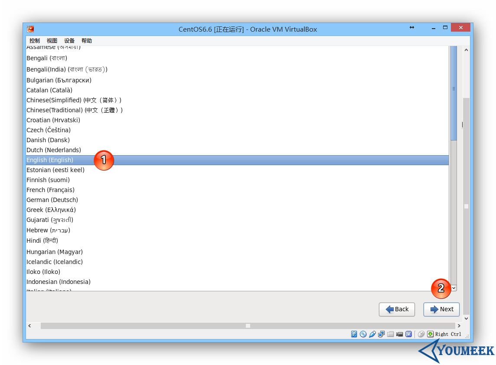
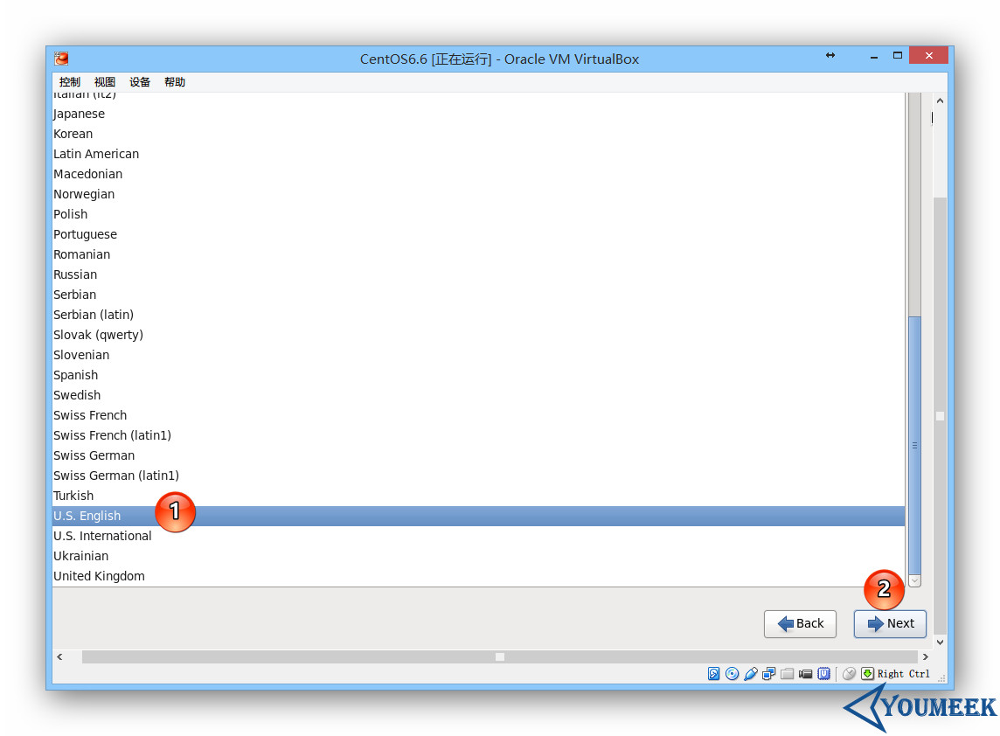

	
# CentOS 安装-图文教程

<h2 id="ubuntu">使用 VirtualBox 下安装过程</h2>

> VirtualBox 的介绍和下载

 
- 在 VirtualBox 中 安装
 - 
 	- 如上图标注 1 所示：点击 `新建` 一个虚拟机。
 	- 如上图标注 2 所示：在填写 `名称` 的时候，输入 `CentOS` 相关字眼的时候，下面的版本类型会跟着变化，自动识别这是 `Red Hat`。
 - 
 - 
 - 
	- 如上图标注 1 所示：选择 `VirtualBox` 的磁盘印象
 - 
 	- 可以根据个人需要选择`固定`还是`动态分配` 
 - 
 	- 如上图标注 1 命名最好是规范
 	- 如上图标注 2 给虚拟机根据个人配置分配空间大小
 - 
 - 
 - 
 - 
 	- 如上图标注 1 有中文界面,看个人需要 
 - 
 - 
 - 
 - 
 - 
 - 
 - 
 - 
 - 
 - 
 - 
 - 
 	- `Desktop` 代表是图形界面版,会默认安装很多软件,建议新手选择此模式
 	- `basic sever` Dos界面,大神模式 
 - 
 	- 自动安装软件
 - 
 -  
 	- 安装完成后最好把盘片删除,防止默认启动会读盘

<h2 id="buntu">使用 VMware 下安装过程</h2>	   
 -  
 - 
 - 
 - 
    - 不要先安装镜像文件,
 - 
 - 
	- 现在把镜像文件装进去  
 - 
 - 
 - 
	- 桥接模式:创建一个独立的虚拟主机,在桥接模式下的虚拟主机网络一般要为其配ip地址,子网掩码,(虚拟机ip地址要与主机ip地址处于同网段)
	- net模式:把物理主机作为路由器进行访问互联网,优势:联网简单,劣势:虚拟主机无法与物理主机通讯
	- 主机模式:把虚拟主机网络与真实网络隔开,但是各个虚拟机之间可以互相连接,虚拟机和物理机也可以连接
 - 
	- Buslogic和LSIlogic都是虚拟硬盘SCSI设备的类型，旧版本的OS 默认的是Buslogic，LSIlogic类型的硬盘改进了性能，对于小文件的读取速度有提高,支持非SCSI硬盘比较好。 
 - 
 - 
 - 
 - 
 - 
 - 
 - 
 - 
 - 
 - 
 - 
 - 
 - 
 - 
 - 