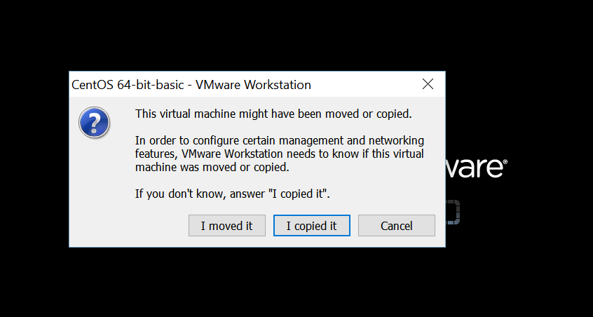

# VMware 克隆 CentOS 后网卡信息修改

## 概述

- 在我们需要多台 CentOS 虚拟机的时候，对已有虚拟机的系统进行克隆或是复制。但是这样做又有一个问题，克隆出来的虚拟机启动的时候你输入命令：`ifconfig`，eth0 网卡信息没了，只有一个 eth1。 对于处女座的人来讲这是不允许的。所以我们需要改动下。
- 复制虚拟机后，首次打开该会提示如下内容，一般选择 copy 这个配置。
	- 

## 修改方法

- 命令：`sudo vim /etc/udev/rules.d/70-persistent-net.rules`
    - 该文件中正常此时应该有两行信息
    - 在文件中把 NAME="eth0″ 的这一行注释掉
    - 对于另一行，把 NAME=”eth1″ 的这一行，把 NAME=”eth1″ 改为 NAME=”eth0″，并且把该行：ATTRS{address}=="00:0c:29:4c:46:01″ 这个属性信息记下来，每台机子都不一样，我这段信息只是例子，你不要直接复制我的。

- 命令：`sudo vim /etc/sysconfig/network-scripts/ifcfg-eth0`
    - 修改 IP 地址
    - 把 HWADDR 的值改为上面要求记下来的：00:0c:29:4c:46:01
    
- 命令：`nmcli con > /opt/info.txt`
    - 如果显示两行 UUID 的信息的话，复制不是 System eth0 的那个 UUID 值，下面有用。
    - 编辑：`sudo vim /etc/sysconfig/network-scripts/ifcfg-eth0`
    - 把文件中的 UUID 值 改为上面要求复制的 UUID 值。
    - 保存配置文件，重启系统，正常应该是可以了。