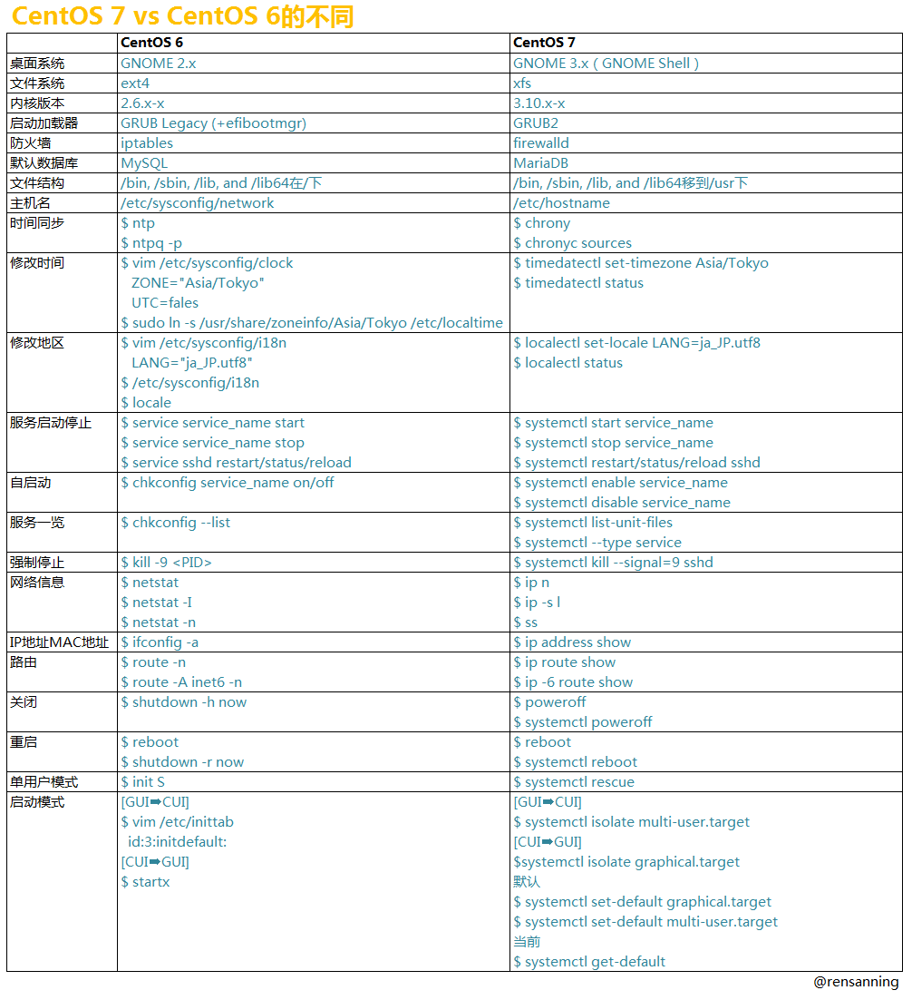

# CentOS 6 和 CentOS 7 介绍

## 总体差异

- 

## 想装回过去的一些工具

- 安装：`yum install -y tree net-tools bind-utils tree sysstat vim-en* lrzsz NetworkManager-tui ntp ntpdate iftop tcpdump telnet traceroute`

## 查看版本号/主机名

- `cat /etc/redhat-release`
- `cat /etc/hostname`

## 常用配置差异

- [CentOS 网络配置](centos-settings/CentOS-Network-Settings.md)
- [CentOS 图形界面的关闭与开启](centos-settings/Close-XWindow.md)

## systemctl 的用法

- 相当于 CentOS 6 的：service nginx stop
- `systemctl is-enabled iptables.service` #查询服务是否开机启动
- `systemctl enable iptables.service` #开机运行服务
- `systemctl disable iptables.service` #取消开机运行
- `systemctl start iptables.service` #启动服务
- `systemctl stop iptables.service` #停止服务
- `systemctl restart iptables.service` #重启服务
- `systemctl reload iptables.service` #重新加载服务配置文件
- `systemctl status iptables.service` #查询服务运行状态
- `systemctl --failed` #显示启动失败的服务
- `systemctl list-units --type=service` #查看所有服务
- `systemctl is-enabled httpd` #查看httpd服务是否开机启动
- 对于启动脚本的存放位置，也不再是 `/etc/init.d/`（这个目录也是存在的），而是 `/usr/lib/systemd/system/`

## 关闭 firewall 使用 iptables

- 关闭 firewall
	- `systemctl stop firewalld.service` #停止firewall
	- `systemctl disable firewalld.service` #禁止firewall开机启动
- 安装 iptables
	- yum install -y iptables-services
- 启动 iptables
	- systemctl restart iptables.service #最后重启防火墙使配置生效
	- systemctl enable iptables.service #设置防火墙开机启动
	- 其他使用照旧

## ifconfig 没有了

- 查看网络配置：`ip a`
- 装回 ifconfig：`yum install -y net-tools`

## 设置时区

- `timedatectl set-timezone Asia/Shanghai`
- `timedatectl status`

## 资料

- <http://blog.topspeedsnail.com/archives/3017>
- <http://chenbaocheng.com/2015/07/15/Centos-7-%E5%AE%89%E8%A3%85%E9%85%8D%E7%BD%AEiptables/>
- <http://cuidehua.blog.51cto.com/5449828/1858374>
- <http://putty.biz/760>
