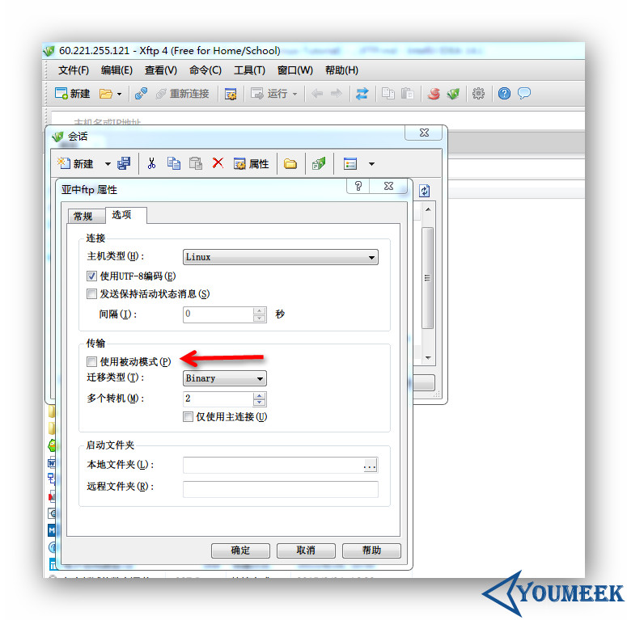

# FTP（File Transfer Protocol）介绍

## FTP 安装

- 查看是否已安装：
 - CentOS：`rpm -qa | grep vsftpd`
 - Ubuntu：`dpkg -l | grep vsftpd`

- 安装：
 - CentOS 6：`sudo yum install -y vsftpd`
 - Ubuntu：`sudo apt-get install -y vsftpd`

## FTP 使用之前要点

- 关闭 CentOS 上的 SELinux 组件（Ubuntu 体系是没有这东西的）。
 - 查看 SELinux 开启状态：`sudo getenforce`
    - 有如下三种状态，默认是 Enforcing
        - Enforcing（开启）
        - Permissive（开启，但是只起到警告作用，属于比较轻的开启）
        - Disabled（关闭）
    - 临时关闭：
        - 命令：`sudo setenforce 0`
    - 临时开启：
        - 命令：`sudo setenforce 1`
    - 永久关闭：
        - 命令：`sudo vim /etc/selinux/config`
        - 将：`SELINUX=enforcing` 改为 `SELINUX=disbaled`，配置好之后需要重启系统。

## FTP 服务器配置文件常用参数

- vsftpd 默认是支持使用 Linux 系统里的账号进行登录的（登录上去可以看到自己的 home 目录内容），权限跟 Linux 的账号权限一样。但是建议使用软件提供的虚拟账号管理体系功能，用虚拟账号登录。
- 配置文件介绍（记得先备份）：`sudo vim /etc/vsftpd/vsftpd.conf`，比较旧的系统版本是：`vim /etc/vsftpd.conf`
 - 该配置主要参数解释：
    - anonymous_enable=NO           #不允许匿名访问，改为YES即表示可以匿名登录
    - anon_upload_enable=YES        #是否允许匿名用户上传
    - anon_mkdir_write_enable=YES   #是否允许匿名用户创建目录
    - local_enable=YES              #是否允许本地用户，也就是linux系统的已有账号，如果你要FTP的虚拟账号，那可以改为NO
    - write_enable=YES              #是否允许本地用户具有写权限
    - local_umask=022               #本地用户掩码
    - chroot_list_enable=YES        #不锁定用户在自己的家目录，默认是注释，建议这个一定要开，比如本地用户judasn，我们只能看到/home/judasn，没办法看到/home目录
    - chroot_list_file=/etc/vsftpd/chroot_list   #该选项是配合上面选项使用的。此文件中的用户将启用 chroot，如果上面的功能开启是不够的还要把用户名加到这个文件里面。配置好后，登录的用户，默认登录上去看到的根目录就是自己的home目录。
    - listen=YES                    #独立模式
    - userlist_enable=YES           #用户访问控制，如果是YES，则表示启用vsftp的虚拟账号功能，虚拟账号配置文件是/etc/vsftpd/user_list
    - userlist_deny=NO              #这个属性在配置文件是没有的，当userlist_enable=YES，这个值也为YES，则user_list文件中的用户不能登录FTP，列表外的用户可以登录，也可以起到一个黑名单的作用。当userlist_enable=YES，这个值为NO，则user_list文件中的用户能登录FTP，列表外的用户不可以登录，也可以起到一个白名单的作用。如果同一个用户即在白名单中又在ftpusers黑名单文件中，那还是会以黑名单为前提，对应账号没法登录。
    - tcp_wrappers=YES              #是否启用TCPWrappers管理服务
 - FTP用户黑名单配置文件：`sudo vim /etc/vsftpd/ftpusers`，默认root用户也在黑名单中
 - 控制FTP用户登录配置文件：`sudo vim /etc/vsftpd/user_list`
- 启动服务：
 - `service vsftpd restart`

## vsftpd 的两种传输模式

- 分为：主动模式（PORT）和被动模式（PASV）。这两个模式会涉及到一些端口问题，也就涉及到防火墙问题，所以要特别注意。主动模式比较简单，只要在防火墙上放开放开 21 和 20 端口即可。被动模式则要根据情况放开一个端口段。
 - 
 - 上图箭头：xftp 新建连接默认都是勾选被动模式的，所以如果要使用主动模式，在该连接的属性中是要去掉勾选。

## vsftpd 的两种运行模式

- 分为：xinetd 模式和 standalone 模式
 - xinetd 模式：由 xinetd 作为 FTP 的守护进程，负责 21 端口的监听，一旦外部发起对 21 端口的连接，则调用 FTP 的主程序处理，连接完成后，则关闭 FTP 主程序，释放内存资源。好处是资源占用少，适合 FTP 连接数较少的场合。
 - standalone 模式：直接使用 FTP 主程序作为 FTP 的守护进程，负责 21 端口的监听，由于无需经过 xinetd 的前端代理，响应速度快，适合连接数 较大的情况，但由于 FTP 主程序长期驻留内存，故较耗资源。
 - standalone 一次性启动，运行期间一直驻留在内存中，优点是对接入信号反应快，缺点是损耗了一定的系统资源，因此经常应用于对实时反应要求较高的 专业 FTP 服务器。
 - xinetd 恰恰相反，由于只在外部连接发送请求时才调用 FTP 进程，因此不适合应用在同时连接数量较多的系统。此外，xinetd 模式不占用系统资源。除了反应速度和占用资源两方面的影响外，vsftpd 还提供了一些额外的高级功能，如 xinetd 模式支持 per_IP (单一 IP)限制，而 standalone 模式则更有利于 PAM 验证功能的应用。
    - 配置 xinetd 模式：  
        - 编辑配置文件：`sudo vim /etc/xinetd.d/vsftpd`
        - 属性信息改为如下信息：
            - disable = no
            - socket_type = stream
            - wait = no     #这表示设备是激活的，它正在使用标准的TCP Sockets 
        - 编辑配置文件：`sudo vim /etc/vsftpd/vsftpd.conf`
        - 如果该配置选项中的有 `listen=YES`，则要注释掉
    - 重启 xinetd 服务，命令：`sudo /etc/rc.d/init.d/xinetd restart`
    - 配置 standalone 模式：
        - 编辑配置文件：`sudo vim /etc/xinetd.d/vsftpd`
        - 属性信息改为如下信息：
            - disable = yes
        - 编辑配置文件：`sudo vim /etc/vsftpd/vsftpd.conf`
        - 属性信息改为如下信息：
            - Listen=YES（如果是注释掉则要打开注释）
    - 重启服务：`sudo service vsftpd restart`
        
## FTP 资料

- <http://www.jikexueyuan.com/course/994.html>
- <http://www.while0.com/36.html>
- <http://www.cnblogs.com/CSGrandeur/p/3754126.html>
- <http://www.centoscn.com/image-text/config/2015/0613/5651.html>
- <http://wiki.ubuntu.org.cn/Vsftpd>
