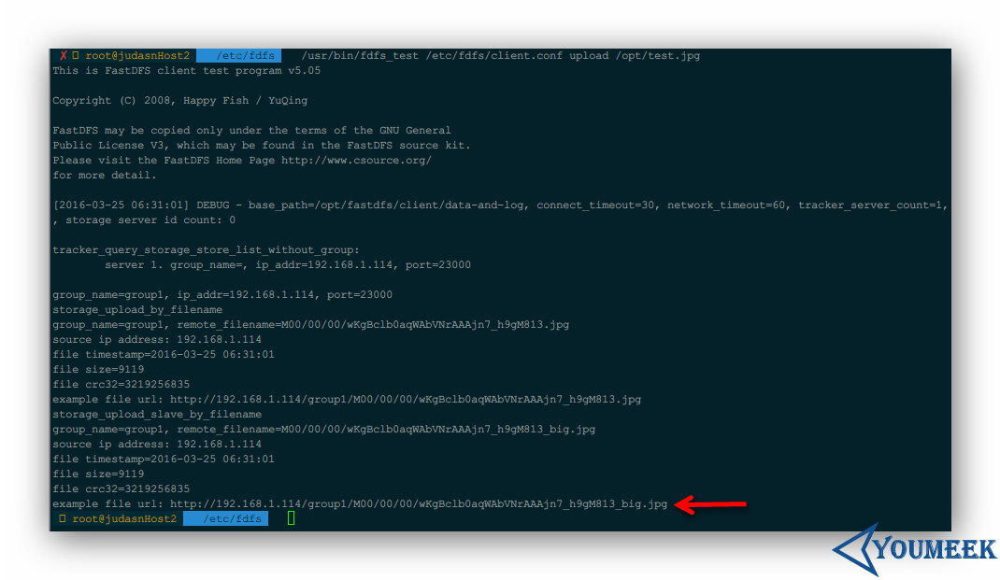

# FastDFS 结合 GraphicsMagick


## 单机安装部署（CentOS 6.7 环境）


### 先安装 FastDFS

- 软件准备：
	- 我这边统一提供了一个压缩包，方便使用。
		- 下载地址：<http://pan.baidu.com/s/1hsg2brA>
- 安装依赖包：`yum install -y gcc gcc-c++ pcre pcre-devel zlib zlib-devel openssl openssl-devel libevent`
- 安装 **libfastcommon-1.0.7.tar.gz**
    - 解压：`tar zxvf libfastcommon-1.0.7.tar.gz`
    - 进入解压后目录：`cd libfastcommon-1.0.7/`
    - 编译：`./make.sh`
    - 安装：`./make.sh install`
    - 设置几个软链接：`ln -s /usr/lib64/libfastcommon.so /usr/local/lib/libfastcommon.so`  
    - 设置几个软链接：`ln -s /usr/lib64/libfastcommon.so /usr/lib/libfastcommon.so`  
    - 设置几个软链接：`ln -s /usr/lib64/libfdfsclient.so /usr/local/lib/libfdfsclient.so`  
    - 设置几个软链接：`ln -s /usr/lib64/libfdfsclient.so /usr/lib/libfdfsclient.so` 
- 安装 tracker （跟踪器）服务 **FastDFS_v5.08.tar.gz**
    - 解压：`tar zxvf FastDFS_v5.05.tar.gz`
    - 进入解压后目录：`cd FastDFS/`
    - 编译：`./make.sh`
    - 安装：`./make.sh install`
- 配置 tracker 服务
    - 复制一份配置文件：`cp /etc/fdfs/tracker.conf.sample /etc/fdfs/tracker.conf`
    - 编辑：`vim /etc/fdfs/tracker.conf`，编辑内容看下面中文注释
    ``` ini
    disabled=false
    bind_addr=
    port=22122
    connect_timeout=30
    network_timeout=60
    # 下面这个路径是保存 store data 和 log 的地方，需要我们改下，指向我们一个存在的目录
    # 创建目录：mkdir -p /opt/fastdfs/tracker/data-and-log
    base_path=/opt/fastdfs/tracker/data-and-log
    max_connections=256
    accept_threads=1
    work_threads=4
    store_lookup=2
    store_group=group2
    store_server=0
    store_path=0
    download_server=0
    reserved_storage_space = 10%
    log_level=info
    run_by_group=
    run_by_user=
    allow_hosts=*
    sync_log_buff_interval = 10
    check_active_interval = 120
    thread_stack_size = 64KB
    storage_ip_changed_auto_adjust = true
    storage_sync_file_max_delay = 86400
    storage_sync_file_max_time = 300
    use_trunk_file = false 
    slot_min_size = 256
    slot_max_size = 16MB
    trunk_file_size = 64MB
    trunk_create_file_advance = false
    trunk_create_file_time_base = 02:00
    trunk_create_file_interval = 86400
    trunk_create_file_space_threshold = 20G
    trunk_init_check_occupying = false
    trunk_init_reload_from_binlog = false
    trunk_compress_binlog_min_interval = 0
    use_storage_id = false
    storage_ids_filename = storage_ids.conf
    id_type_in_filename = ip
    store_slave_file_use_link = false
    rotate_error_log = false
    error_log_rotate_time=00:00
    rotate_error_log_size = 0
    log_file_keep_days = 0
    use_connection_pool = false
    connection_pool_max_idle_time = 3600
    http.server_port=8080
    http.check_alive_interval=30
    http.check_alive_type=tcp
    http.check_alive_uri=/status.html
    ```
    - 启动 tracker 服务：`/usr/bin/fdfs_trackerd /etc/fdfs/tracker.conf`
    - 重启 tracker 服务：`/usr/bin/fdfs_trackerd /etc/fdfs/tracker.conf restart`
    - 查看是否有 tracker 进程：`ps aux | grep tracker`
- storage （存储节点）服务部署
    - 一般 storage 服务我们会单独装一台机子，但是这里为了方便我们安装在同一台。
    - 如果 storage 单独安装的话，那上面安装的步骤都要在走一遍，只是到了编辑配置文件的时候，编辑的是 storage.conf 而已
    - 复制一份配置文件：`cp /etc/fdfs/storage.conf.sample /etc/fdfs/storage.conf`
    - 编辑：`vim /etc/fdfs/storage.conf`，编辑内容看下面中文注释
    ``` ini
    disabled=false
    group_name=group1
    bind_addr=
    client_bind=true
    port=23000
    connect_timeout=30
    network_timeout=60
    heart_beat_interval=30
    stat_report_interval=60
    # 下面这个路径是保存 store data 和 log 的地方，需要我们改下，指向我们一个存在的目录
    # 创建目录：mkdir -p /opt/fastdfs/storage/data-and-log
    base_path=/opt/fastdfs/storage/data-and-log
    max_connections=256
    buff_size = 256KB
    accept_threads=1
    work_threads=4
    disk_rw_separated = true
    disk_reader_threads = 1
    disk_writer_threads = 1
    sync_wait_msec=50
    sync_interval=0
    sync_start_time=00:00
    sync_end_time=23:59
    write_mark_file_freq=500
    store_path_count=1
    # 图片实际存放路径，如果有多个，这里可以有多行：
    # store_path0=/opt/fastdfs/storage/images-data0
    # store_path1=/opt/fastdfs/storage/images-data1
    # store_path2=/opt/fastdfs/storage/images-data2
    # 创建目录：mkdir -p /opt/fastdfs/storage/images-data
    store_path0=/opt/fastdfs/storage/images-data
    subdir_count_per_path=256
    # 指定 tracker 服务器的 IP 和端口
    tracker_server=192.168.1.114:22122
    log_level=info
    run_by_group=
    run_by_user=
    allow_hosts=*
    file_distribute_path_mode=0
    file_distribute_rotate_count=100
    fsync_after_written_bytes=0
    sync_log_buff_interval=10
    sync_binlog_buff_interval=10
    sync_stat_file_interval=300
    thread_stack_size=512KB
    upload_priority=10
    if_alias_prefix=
    check_file_duplicate=0
    file_signature_method=hash
    key_namespace=FastDFS
    keep_alive=0
    use_access_log = false
    rotate_access_log = false
    access_log_rotate_time=00:00
    rotate_error_log = false
    error_log_rotate_time=00:00
    rotate_access_log_size = 0
    rotate_error_log_size = 0
    log_file_keep_days = 0
    file_sync_skip_invalid_record=false
    use_connection_pool = false
    connection_pool_max_idle_time = 3600
    http.domain_name=
    http.server_port=8888
    ```
    - 启动 storage 服务：`/usr/bin/fdfs_storaged /etc/fdfs/storage.conf`，首次启动会很慢，因为它在创建预设存储文件的目录
    - 重启 storage 服务：`/usr/bin/fdfs_storaged /etc/fdfs/storage.conf restart`
    - 查看是否有 storage 进程：`ps aux | grep storage`
- 测试是否部署成功
    - 利用自带的 client 进行测试
    - 复制一份配置文件：`cp /etc/fdfs/client.conf.sample /etc/fdfs/client.conf`
    - 编辑：`vim /etc/fdfs/client.conf`，编辑内容看下面中文注释
    ``` ini
    connect_timeout=30
    network_timeout=60
    # 下面这个路径是保存 store log 的地方，需要我们改下，指向我们一个存在的目录
    # 创建目录：mkdir -p /opt/fastdfs/client/data-and-log
    base_path=/opt/fastdfs/client/data-and-log
    # 指定 tracker 服务器的 IP 和端口
    tracker_server=192.168.1.114:22122
    log_level=info
    use_connection_pool = false
    connection_pool_max_idle_time = 3600
    load_fdfs_parameters_from_tracker=false
    use_storage_id = false
    storage_ids_filename = storage_ids.conf
    http.tracker_server_port=80
    ```
    - 在终端中通过 shell 上传 opt 目录下的一张图片：`/usr/bin/fdfs_test /etc/fdfs/client.conf upload /opt/test.jpg`
    - 如下图箭头所示，生成的图片地址为：`http://192.168.1.114/group1/M00/00/00/wKgBclb0aqWAbVNrAAAjn7_h9gM813_big.jpg`
     - 
    - 即使我们现在知道图片的访问地址我们也访问不了，因为我们还没装 FastDFS 的 Nginx 模块


### 安装 nginx-lua-GraphicsMagick

- 来源：<https://github.com/yanue/nginx-lua-GraphicsMagick/blob/master/nginx-install.md>
- 添加专用用户，后面有用
	- `groupadd www`
	- `useradd -g www www -s /bin/false`
- 安装依赖包
	- `yum install -y gcc gcc-c++ zlib zlib-devel openssl openssl-devel pcre pcre-devel`
	- `yum install -y libpng libjpeg libpng-devel libjpeg-devel ghostscript libtiff libtiff-devel freetype freetype-devel`
	- `yum install -y GraphicsMagick GraphicsMagick-devel`
- 下面的这些软件都在本文在开头的那个压缩包里面。现在我们需要解压这些压缩包
	- `cd /opt/setups`
	- `tar -zxvf nginx-1.8.0.tar.gz`
	- `tar -zxvf LuaJIT-2.0.4.tar.gz`
	- `tar -zxvf GraphicsMagick-1.3.21.tar.gz`
	- `tar -zxvf zlib-1.2.8.tar.gz`
- 安装 LuaJIT
	- `cd /opt/setups/LuaJIT-2.0.4`
	- `make`
	- `make install`
	- `export LUAJIT_LIB=/usr/local/lib`
	- `export LUAJIT_INC=/usr/local/include/luajit-2.0`
	- `ln -s /usr/local/lib/libluajit-5.1.so.2 /lib64/libluajit-5.1.so.2`
- 修改一些配置文件
    - 编辑 Nginx 模块的配置文件：`vim /opt/setups/fastdfs-nginx-module/src/config`
    - 找到下面一行包含有 `local` 字眼去掉，因为这三个路径根本不是在 local 目录下的。（如果你的配置文件没有这个 local，那这一步跳过）
    ``` nginx
    CORE_INCS="$CORE_INCS /usr/local/include/fastdfs /usr/local/include/fastcommon/"
    ```
    - 改为如下：
    ``` nginx
    CORE_INCS="$CORE_INCS /usr/include/fastdfs /usr/include/fastcommon/"
    ```
    - 复制文件：`cp /opt/setups/FastDFS/conf/http.conf /etc/fdfs`
    - 复制文件：`cp /opt/setups/FastDFS/conf/mime.types /etc/fdfs`
- 开始安装 Nginx
	- `cd /opt/setups/nginx-1.8.0`
	- `mkdir -p /usr/local/nginx /var/log/nginx /var/temp/nginx /var/lock/nginx`
	- 执行下面编译语句：
	``` nginx
    ./configure --prefix=/usr/local/nginx \
    --user=www \
    --group=www \
    --pid-path=/var/local/nginx/nginx.pid  \
    --lock-path=/var/lock/nginx/nginx.lock \
    --error-log-path=/var/log/nginx/error.log \
    --http-log-path=/var/log/nginx/access.log \
    --http-client-body-temp-path=/var/temp/nginx/client \
    --http-proxy-temp-path=/var/temp/nginx/proxy \
    --http-fastcgi-temp-path=/var/temp/nginx/fastcgi \
    --http-uwsgi-temp-path=/var/temp/nginx/uwsgi \
    --http-scgi-temp-path=/var/temp/nginx/scgi \
    --sbin-path=/usr/local/nginx/sbin/nginx \
    --with-http_ssl_module \
    --with-http_realip_module \
    --with-http_sub_module \
    --with-http_flv_module \
    --with-http_dav_module \
    --with-http_gzip_static_module \
    --with-http_stub_status_module \
    --with-http_addition_module \
    --with-http_spdy_module \
    --with-pcre \
    --with-zlib=/opt/setups/zlib-1.2.8 \
    --add-module=/opt/setups/nginx-http-concat \
    --add-module=/opt/setups/lua-nginx-module \
    --add-module=/opt/setups/ngx_devel_kit \
    --add-module=/opt/setups/fastdfs-nginx-module/src
	```
	- `make`
	- `make install`
- 修改一下配置
    - 复制 Nginx 模块的配置文件：`cp /opt/setups/fastdfs-nginx-module/src/mod_fastdfs.conf /etc/fdfs`
    - 编辑 Nginx 模块的配置文件：`vim /etc/fdfs/mod_fastdfs.conf`，编辑内容看下面中文注释
    - 如果在已经启动 Nginx 的情况下修改下面内容记得要重启 Nginx。
    ``` ini
    connect_timeout=2
    network_timeout=30
    # 下面这个路径是保存 log 的地方，需要我们改下，指向我们一个存在的目录
    # 创建目录：mkdir -p /opt/fastdfs/fastdfs-nginx-module/data-and-log
    base_path=/opt/fastdfs/fastdfs-nginx-module/data-and-log
    load_fdfs_parameters_from_tracker=true
    storage_sync_file_max_delay = 86400
    use_storage_id = false
    storage_ids_filename = storage_ids.conf
    # 指定 tracker 服务器的 IP 和端口
    tracker_server=192.168.1.114:22122
    storage_server_port=23000
    group_name=group1
    # 因为我们访问图片的地址是：http://192.168.1.114/group1/M00/00/00/wKgBclb0aqWAbVNrAAAjn7_h9gM813_big.jpg
    # 该地址前面是带有 /group1/M00，所以我们这里要使用 true，不然访问不到（原值是 false）
    url_have_group_name = true
    store_path_count=1
    # 图片实际存放路径，如果有多个，这里可以有多行：
    # store_path0=/opt/fastdfs/storage/images-data0
    # store_path1=/opt/fastdfs/storage/images-data1
    # store_path2=/opt/fastdfs/storage/images-data2
    store_path0=/opt/fastdfs/storage/images-data
    log_level=info
    log_filename=
    response_mode=proxy
    if_alias_prefix=
    flv_support = true
    flv_extension = flv
    group_count = 0
    ```
	- 创建文件夹：`mkdir -p /opt/fastdfs/thumb`
    - 编辑 Nginx 配置文件
    - `vim /usr/local/nginx/conf/nginx.conf`
    ``` nginx
	# 注意这一行行，我特别加上了使用 root 用户去执行，不然有些日记目录没有权限访问
	user  root;
	worker_processes  1;
	
	
	events {
	    worker_connections  1024;
	}
	
	
	http {
	    include       mime.types;
	    default_type  application/octet-stream;
	
	    sendfile        on;
	
	    keepalive_timeout  65;
	
	
		server{
		    listen      80;
		    server_name 192.168.1.112;
		
		    set $img_thumbnail_root /opt/fastdfs/thumb; 
		    set $img_file $img_thumbnail_root$uri;  
		
		    # like：/pic/M00/xx/xx/xx.jpg_200x100.jpg
		    # /group1/M00
		    location ~* ^(\/(\w+)(\/M00)(.+\.(jpg|jpeg|gif|png))_(\d+)+x(\d+)+\.(jpg|jpeg|gif|png))$ {
		            root $img_thumbnail_root;    
		            set $fdfs_group_root /opt/fastdfs/storage/images-data/data; 
					
					# 如果缩略图不存在
		            if (!-f $img_file) {   
		                    add_header X-Powered-By 'Nginx+Lua+GraphicsMagick By Yanue';  
		                    add_header file-path $request_filename;
		                    
		                    set $request_filepath $fdfs_group_root$4;    
		                    set $img_width $6;    
		                    set $img_height $7;    
		                    set $img_ext $5;     
		                    content_by_lua_file /opt/setups/lua/cropSize.lua;   
		            }
		    }
		
		    location /group1/M00 {
		            alias /opt/fastdfs/storage/images-data/data;
		            ngx_fastdfs_module;
		    }
		
		}
	}
    ```
    - 启动 Nginx
        - 停掉防火墙：`service iptables stop`
        - 启动：`/usr/local/nginx/sbin/nginx`，启动完成 shell 是不会有输出的
        - 访问：`192.168.1.114`，如果能看到：`Welcome to nginx!`，即可表示安装成功
        - 检查 时候有 Nginx 进程：`ps aux | grep nginx`，正常是显示 3 个结果出来 
        - 刷新 Nginx 配置后重启：`/usr/local/nginx/sbin/nginx -s reload`
        - 停止 Nginx：`/usr/local/nginx/sbin/nginx -s stop`
        - 如果访问不了，或是出现其他信息看下错误立即：`vim /var/log/nginx/error.log`


### 多机安装部署（CentOS 6.7 环境）

- 多机部署的情况，对生成大小图的 Nginx 也有地方要修改。
- 资料：<http://blog.csdn.net/ricciozhang/article/details/49402273>


## 资料

- [fastdfs+nginx安装配置](http://blog.csdn.net/ricciozhang/article/details/49402273)


