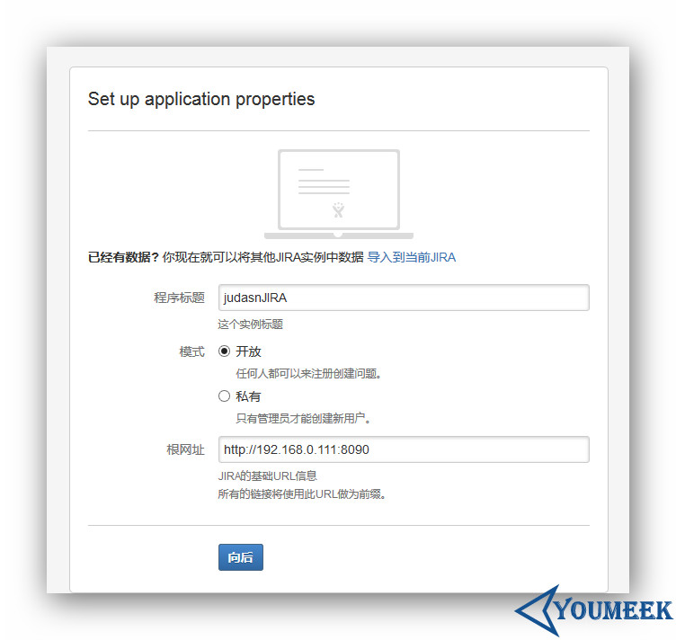
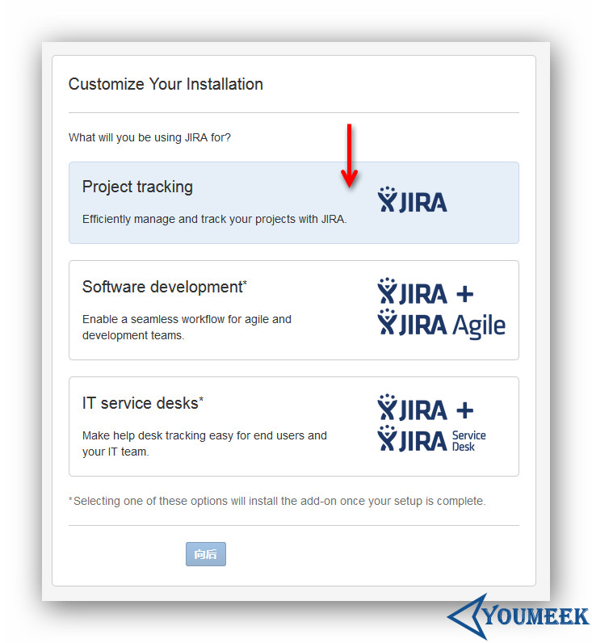
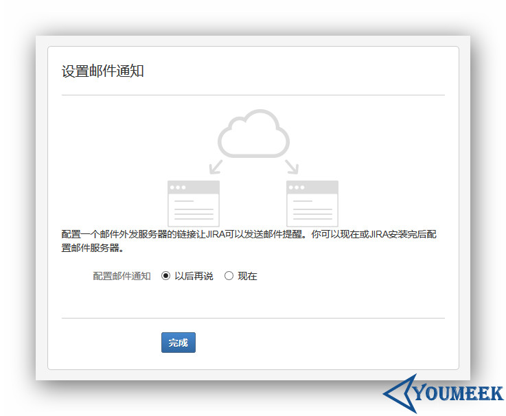

# Jira 安装和配置


## Jira 安装

- Jira 安装
    - 官网：<https://www.atlassian.com/software/jira>
    - 官网下载：<https://www.atlassian.com/software/jira/download>
    - 中文在线试用：<http://www.jira.cn/secure/Dashboard.jspa>
    - 官网帮助说明：<https://confluence.atlassian.com/jira/installing-jira-on-linux-191501165.html>
    - 官网中文语言包：<https://translations.atlassian.com/dashboard/download?lang=zh_CN#/JIRA/6.3.6>
    - Jira 6.3.6 网盘下载：<http://pan.baidu.com/s/1eRjrz5C>
    - Jira 6.3.6 中文语言包网盘下载：<http://pan.baidu.com/s/1i3VEsC1>
    - 环境要求：
        - JDK 7 或更新版本；
        - Mysql
    - 我们要使用的版本：**atlassian-jira-6.3.6.tar.gz**
    - 我个人习惯 `/opt` 目录下创建一个目录 `setups` 用来存放各种软件安装包；在 `/usr` 目录下创建一个 `program` 用来存放各种解压后的软件包，下面的讲解也都是基于此习惯
    - 我个人已经使用了第三方源：`EPEL、RepoForge`，如果你出现 `yum install XXXXX` 安装不成功的话，很有可能就是你没有相关源，请查看我对源设置的文章
    - 解压：`tar zxvf atlassian-jira-6.3.6.tar.gz`
    - 修改目录名：`mv atlassian-jira-6.3.6/ jira6.3.6/`
    - 移到我个人的安装目录下：`mv jira6.3.6/ /usr/program/`
    - 创建存放数据目录：`mkdir -p /usr/program/jira6.3.6/data/`
    - 设置环境变量：
        - 编辑：`vim /etc/profile`
        - 在文件尾部添加：
        ``` ini
        JIRA_HOME=/usr/program/jira6.3.6/data/
        export JIRA_HOME
        ```
        - 刷新配置：`source /etc/profile`
    - 运行：`/usr/program/jira6.3.6/bin/start-jira.sh`
    - 访问：`http://192.168.0.111:8080/`
    - 汉化：`cp JIRA-6.3.6-language-pack-zh_CN.jar /usr/program/jira6.3.6/atlassian-jira/WEB-INF/lib/`
    - 配置过程：
        - 
        - 
        - 
        - 
        - 
        - 
    - 重新激活页面地址：`http://192.168.0.111:8090/secure/admin/ViewLicense.jspa`