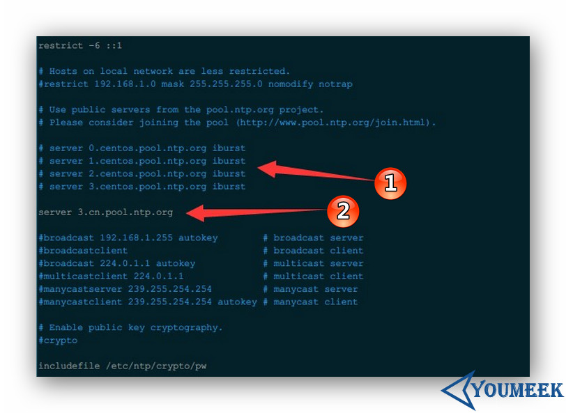

## NTP（Network Time Protocol）介绍


## NTP 安装

- 查看是否已安装：
 - CentOS：`rpm -qa | grep ntp-*`
 - Ubuntu：`dpkg -l | grep ntp-*`

- 安装：
 - CentOS 6：`sudo yum install -y ntp`
 - Ubuntu：`sudo apt-get install -y ntp`

## NTP 服务器配置文件常用参数

- 世界上可以校对时间节点：<http://www.pool.ntp.org/zh> 
- 中国时间校对服务器节点：<http://www.pool.ntp.org/zone/cn> 
- 配置文件介绍（记得先备份）：`sudo vim /etc/ntp.conf`
 - 
 - 该配置解释：
    - 标注 1 是默认内容，我们这里进行了注释。
    - 标注 2 是新增内容，表示使用中国时间校对服务器节点地址。
    ``` nginx
	server 0.asia.pool.ntp.org
	server 1.asia.pool.ntp.org
	server 2.asia.pool.ntp.org
	server 3.asia.pool.ntp.org
    ```
- 启动服务：
 - `sudo service ntpd start`
- 服务加到启动项
	- CentOS 系统
		- `sudo chkconfig ntpd on`
	- Ubuntu 系统
		- `sudo apt-get install -y sysv-rc-conf `
		- `sudo sysv-rc-conf ntpd on`

## NTP 资料

- <http://www.jikexueyuan.com/course/1710.html> 
- <http://www.pool.ntp.org/zh> 
- <http://blog.kissdata.com/2014/10/28/ubuntu-ntp.html> 
