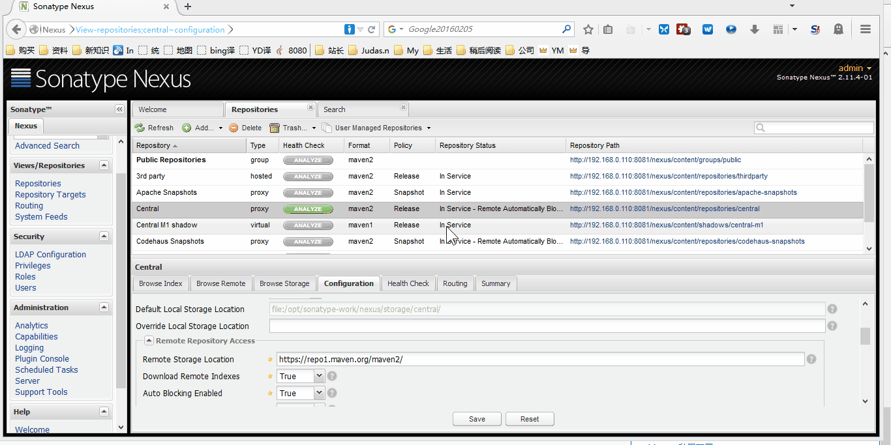

# Nexus 安装和配置


## Nexus 安装

- Nexus 安装
    - 官网：<http://www.sonatype.org/nexus/>
    - 官网下载：<http://www.sonatype.org/nexus/archived/>
    - 此时（20160207） Nexus 最新版本为：**2.12.0-01**
    - JDK 要求是 JDK 7，官网要求 7u6 或之后版本，包括 JDK 8
    - 官网帮助说明 1：<http://books.sonatype.com/nexus-book/2.11/reference/install.html>
    - 官网帮助说明 2：<http://books.sonatype.com/sonatype-clm-book/html/clm-book/installation-configuration.html>
    - 我个人习惯 `/opt` 目录下创建一个目录 `setups` 用来存放各种软件安装包；在 `/usr` 目录下创建一个 `program` 用来存放各种解压后的软件包，下面的讲解也都是基于此习惯
    - 我个人已经使用了第三方源：`EPEL、RepoForge`，如果你出现 `yum install XXXXX` 安装不成功的话，很有可能就是你没有相关源，请查看我对源设置的文章
    - 压缩包下载（由于国内网络的原因不排除你下载不了）：`wget http://download.sonatype.com/nexus/oss/nexus-2.12.0-01-bundle.tar.gz`
    - 如果地址下载不了，那是因为你需要开 VPN，你也可以选择降低要求下载 2.11.4-01 版本：<http://pan.baidu.com/s/1mgSNJtA>
        - 解压压缩包：`tar zxvf nexus-2.11.4-01-bundle.tar.gz`
            - 解压出来有两个文件夹：
            - 这是程序目录：`nexus-2.11.4-01`
            - 这是仓库目录：`sonatype-work`
        - 移到目录到我的安装目录下：`mv nexus-2.11.4-01/ /usr/program/`
        - 进入安装目录：`cd /usr/program/`
        - 把目录名字改为更好看点：`mv nexus-2.11.4-01/ nexus2.11.4/`
        - 编辑系统配置文件：`vim /etc/profile`
        - 在文件的尾巴增加下面内容：
        
        ``` ini
        # Nexus
        NEXUS_HOME=/usr/program/nexus2.11.4
        export NEXUS_HOME
        RUN_AS_USER=root
        export RUN_AS_USER
        ```

        - 刷新配置：`source /etc/profile`
        - 由于目录 `sonatype-work` 以后是做仓库用的，会存储很多 jar，所以这个目录一定要放在磁盘空间大的区内，目前我们还没第一次启动 Nexus，所以这里还是空文件
            - 我个人习惯把这类目录放在 `/opt` 下，所以你要特别注意，下面有内容对这个文件夹进行操作的都是基于 opt 目录的：`mv /opt/setup/sonatype-work/ /opt/`
            - 设置配置文件：`vim /usr/program/nexus2.11.4/conf/nexus.properties`
                - 把文件中该值：`nexus-work=${bundleBasedir}/../sonatype-work/nexus`
                - 改为：`nexus-work=/opt/sonatype-work/nexus`
        - 默认情况下如果你的 JDK 等系统变量设置好的是无需编辑 Nexus 的配置文件，但是这里还是给大家一下配置文件路径：`vim /usr/program/nexus2.11.4/bin/jsw/conf/wrapper.conf`
        - 开放防火墙端口：
            - 添加规则：`sudo iptables -I INPUT -p tcp -m tcp --dport 8081 -j ACCEPT`
            - 保存规则：`sudo /etc/rc.d/init.d/iptables save`
            - 重启 iptables：`sudo service iptables restart`
    - 测试安装结果：
        - 启动 Nexus：`/usr/program/nexus2.11.4/bin/nexus start`
        - 查看启动日志：`tail -200f /usr/program/nexus2.11.4/logs/wrapper.log`
        - 关闭 Nexus：`/usr/program/nexus2.11.4/bin/nexus stop`
        - 访问：http://192.168.0.110:8081/nexus
        - 登录账号密码：
            - 账号密码：**admin**
            - 密码：**admin123**


## Nexus 配置

- 修改默认端口：`vim /usr/program/nexus2.11.4/conf/nexus.properties`，修改该值：application-port=8081
- 下载远程中央库的索引到服务器
    - 
    - 如上图标注 4 所示，把默认是 `False` 改为 `True`
    - 
    - 如上图 gif 所示，创建任务开始进行索引下载。需要特别提醒的是，如果你的私服是虚拟机，那得保证你分配的硬盘足够大，别像我一样吝啬只给 10 G（现在还剩下 1.9 G），结果报：**设备上没有空间**
- 项目上配置链接连接私服（下面内容涉及到 maven 的基础知识，请自行私下学习）：
    - 对项目独立设置：
        - 打开项目的 pom.xml 文件：
        - 添加下面内容：
        ``` xml
        <repositories>
            <repository>
                <id>Nexus</id>
                <name>虚拟机-192.168.0.110-Nexus</name>
                <url>http://192.168.0.110:8081/nexus/content/groups/public/</url>
            </repository>
        </repositories>
        ```
    - 对全局配置进行设置：
        - 打开 maven 的 settings.xml 文件：
        - 添加下面内容：
        ``` xml
        <mirrors>
            <mirror>
                <id>YouMeekNexus</id>
                <name>YouMeek Nexus</name>
                <mirrorOf>*</mirrorOf>
                <url>http://192.168.0.110:8081/nexus/content/groups/public/</url>
            </mirror>
        </mirrors>
        ```


## 持续集成自动构建后发布到 Nexus 上

- 在 Maven 的 settings.xml 加上连接服务器信息：

``` xml
<!--设置私库认证信息，用户名和密码我就用默认的，如果你们有权限控制的需求可以创建对应的一些账号-->  
<servers>  
    <server>  
        <id>nexus-releases</id>  
        <username>admin</username>  
        <password>admin123</password>  
    </server>  
    <server>  
        <id>nexus-snapshots</id>  
        <username>admin</username>  
        <password>admin123</password>  
    </server>  
</servers>  
```


- 在项目的 pom.xml 文件加上：

``` xml
<!-- nexus-releases nexus-snapshots 与 Maven 的配置文件 settings.xml 中 server 下的 id 对应 -->  
<distributionManagement>  
    <repository>  
        <id>nexus-releases</id>  
        <name>Nexus Releases Repository</name>  
        <url>http://192.168.0.110:8081/nexus/content/repositories/releases/</url>  
    </repository>  
    <snapshotRepository>  
        <id>nexus-snapshots</id>  
        <name>Nexus Snapshots Repository</name>  
        <url>http://192.168.0.110:8081/nexus/content/repositories/snapshots/</url>  
    </snapshotRepository>  
</distributionManagement>
```


## Nexus 手动更新索引文件
- 手动更新索引
    - 关闭 Nexus：`/usr/program/nexus2.11.4/bin/nexus stop`
    - 命令：`cd  /opt/sonatype-work/nexus/indexer/central-ctx`
        - 删除里面默认的文件：`rm -rf *`
    - 访问官网索引：<http://repo.maven.apache.org/maven2/.index/>
        - 下载文件：**nexus-maven-repository-index.gz**：`wget http://repo.maven.apache.org/maven2/.index/nexus-maven-repository-index.gz`
        - 下载文件：**nexus-maven-repository-index.properties**：`wget http://repo.maven.apache.org/maven2/.index/nexus-maven-repository-index.properties`
        - 下载索引解压工具：`wget https://repo1.maven.org/maven2/org/apache/maven/indexer/indexer-cli/5.1.1/indexer-cli-5.1.1.jar`
        - 执行解压命令（该命令执行需要4分钟左右）：`java -jar indexer-cli-5.1.0.jar -u nexus-maven-repository-index.gz -d ./`
        - 删除解压前文件：`rm -rf indexer-cli-5.1.0.jar nexus-maven-repository-index.gz nexus-maven-repository-index.properties`
        - 重启服务：`/usr/program/nexus2.11.4/bin/nexus start`


## 资料

- <http://www.cnblogs.com/leefreeman/p/4211530.html>
- <http://www.itdadao.com/article/89071/>
- <http://blog.zhaojunling.me/p/17>
- <http://m.blog.csdn.net/article/details?id=49228873>
- <http://mritd.me/2015/12/29/Nexus-2-11-CentOS%E6%90%AD%E5%BB%BA%E6%95%99%E7%A8%8B/>
- <http://mritd.me/2015/12/28/Nexus-%E7%A7%81%E6%9C%8D%E4%BD%BF%E7%94%A8%E6%95%99%E7%A8%8B/>
- <http://my.oschina.net/liangbo/blog/195739>
- <http://www.mamicode.com/info-detail-1016489.html>
- <http://blog.csdn.net/shawyeok/article/details/23564681>
- <http://zyjustin9.iteye.com/blog/2017321>
