# Openfire 安装和配置

## 本机环境

- 系统：CentOS 6.7 64 位
- JDK 1.7 64 位
- MySQL 5.6

## Openfire 说明

- 官网：<http://www.igniterealtime.org/projects/openfire/>
- 官网下载：<http://www.igniterealtime.org/downloads/index.jsp>
- 官网插件列表：<http://www.igniterealtime.org/projects/openfire/plugins.jsp>
- 官网文档：<http://www.igniterealtime.org/builds/openfire/docs/latest/documentation/>
- 官网安装手册：<http://www.igniterealtime.org/builds/openfire/docs/latest/documentation/install-guide.html>
- 官网安装手册-中文翻译版本：<http://wiki.jabbercn.org/Openfire:%E5%AE%89%E8%A3%85%E6%8C%87%E5%8D%97>
- 官网数据库部署手册：<http://www.igniterealtime.org/builds/openfire/docs/latest/documentation/database.html>
- javadoc 文档：<http://www.igniterealtime.org/builds/openfire/docs/latest/documentation/javadoc/>
- 连接管理工具（上千用户的时候用）：<http://www.igniterealtime.org/projects/openfire/connection_manager.jsp  >

## 下载

- 官网下载：<http://www.igniterealtime.org/downloads/index.jsp>
- 当前最新版本：**4.0.2**，下载文件：`openfire-4.0.2-1.i386.rpm`

## 安装 MySQL、JDK

- [MySQL 安装和配置](Mysql-Install-And-Settings.md)
- [JDK 安装](JDK-Install.md)

## 安装 Openfire

- 要求：JDK 1.7 或以上，我这里使用 1.7
- CentOS 系列（Red Hat、Fedora）官网推荐安装 RPM 文件，因为有一些相关环境他们帮我们考虑了
- 安装命令：`rpm -ivh openfire-4.0.2-1.i386.rpm`
- Openfire 默认给我们生成安装目录：**/opt/openfire**
- 修改 JDK VM 参数：`vim /etc/sysconfig/openfire`，找到 23 行，打开 OPENFIRE_OPTS 删除这一行注释，分配多少 VM 你根据自己的机子来配置。
- 初始化数据库：
	- 请确保数据库是运行状态
	- 默认的初始化数据库脚本在（其他数据库类型的脚本也在这个目录下）：**/opt/openfire/resources/database/openfire_mysql.sql**
	- 进入 MySQL 命令行状态：`mysql -u root -p`
		- 创建数据库并授权：`create database `openfire` character set utf8;grant all privileges on openfire.* to 'root'@'%';flush privileges;`
	- **退出** MySQL 命令行模式，**在终端命令状态下**，执行：`sudo mysql -u root -p openfire < /opt/openfire/resources/database/openfire_mysql.sql`
- 先停掉防火墙：`service iptables stop`
- 启动：`/etc/init.d/openfire start`
- 查看进程：`ps aux | grep openfire`
- 停止：`/etc/init.d/openfire stop`
- 重启：`/etc/init.d/openfire restart`

## 配置

- 访问 Web 管理界面：`http://192.168.1.113:9090`
- 开始向导配置 Openfire 具体步骤看下列一系列图：
	- 需要注意的是：在配置数据库 URL 需要特别注意的是需要加入编码设置（你可以按我的这个链接来，但是 IP 和数据库名你自己修改）：
		- `jdbc:mysql://192.168.1.113:3306/openfire?rewriteBatchedStatements=true&useUnicode=true&characterEncoding=UTF-8&characterSetResults=UTF-8`
	- 如果连接不了数据库，可以看错误日志：`cat /opt/openfire/logs/error.log`
- 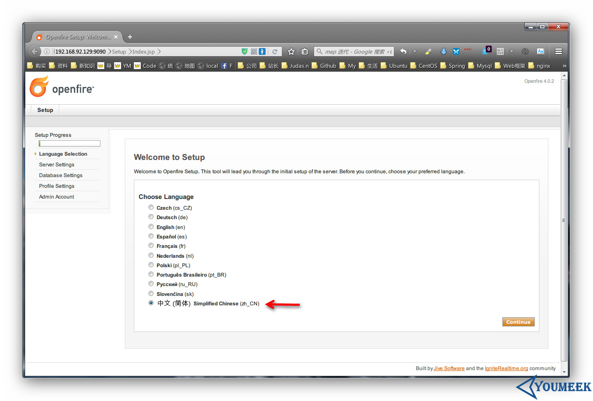
- 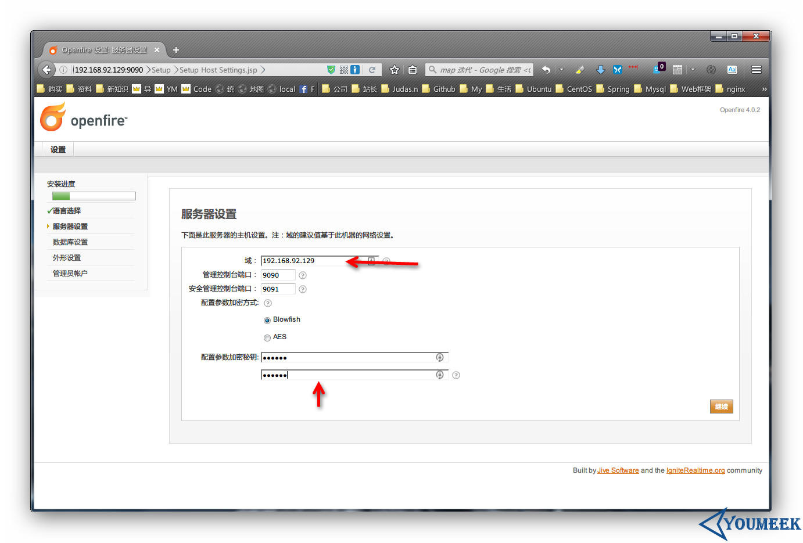
- 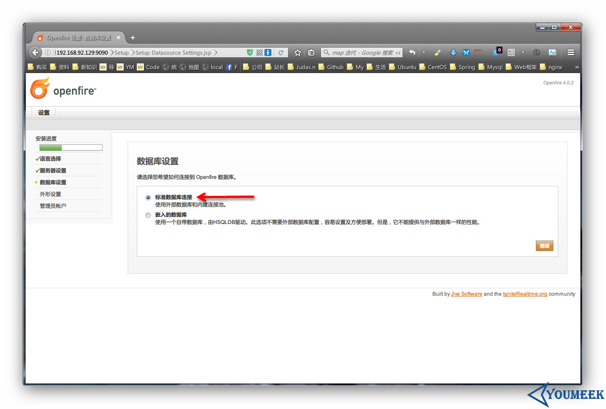
- 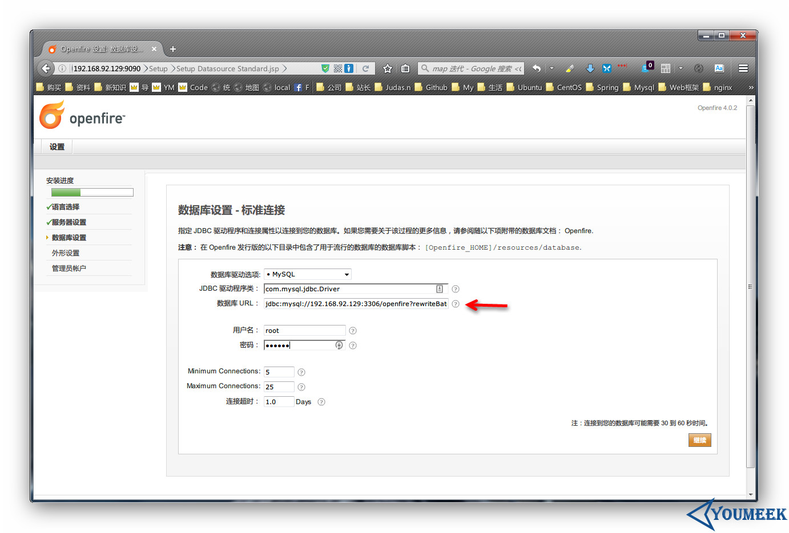
- 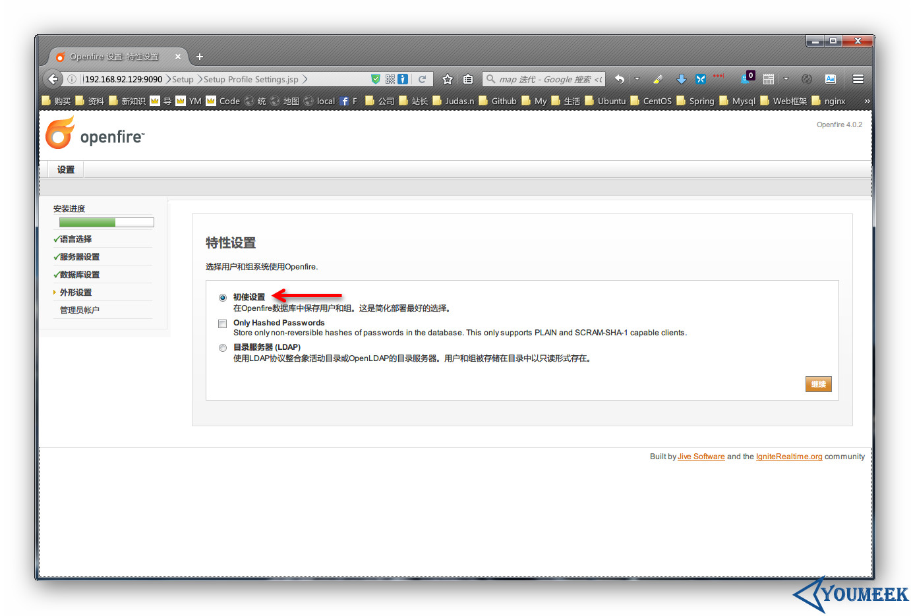
- 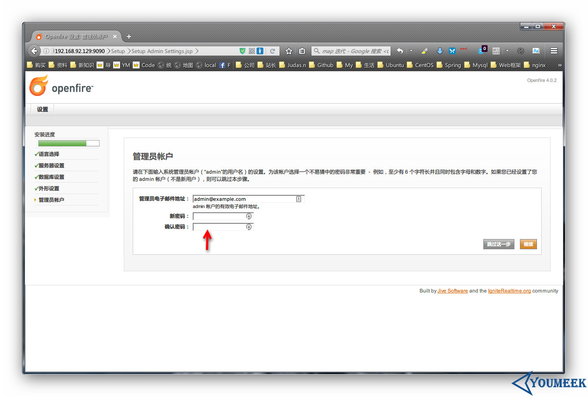
- 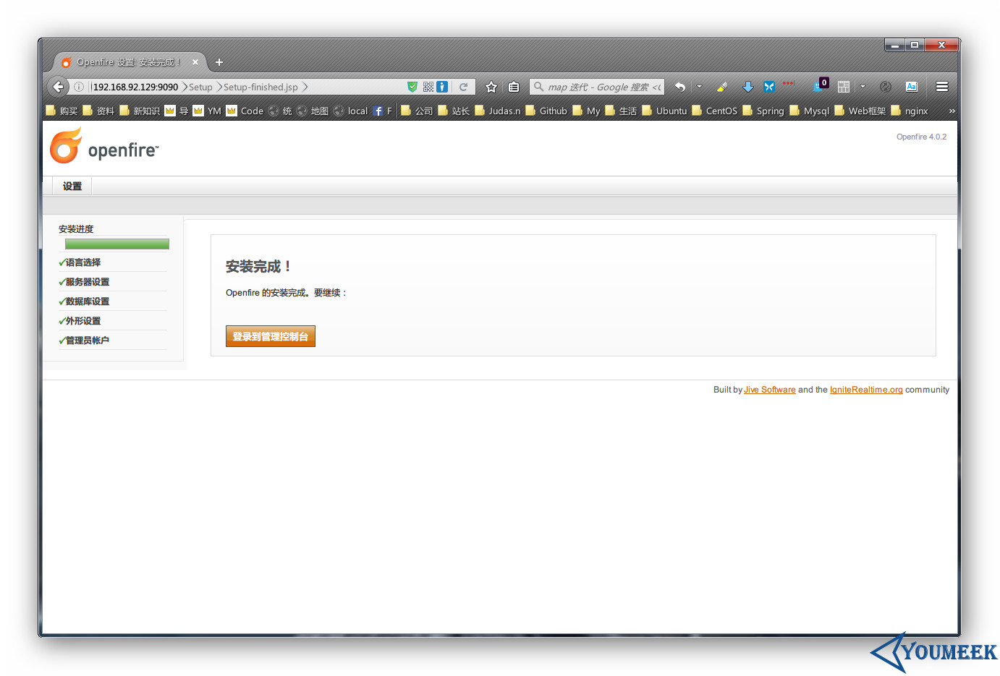
- 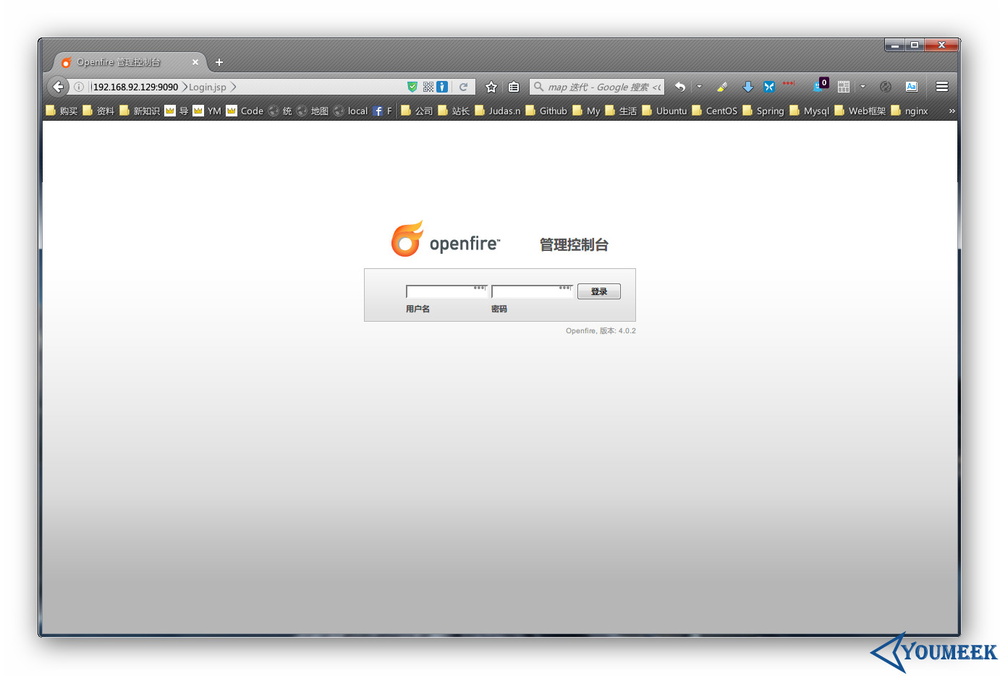
- 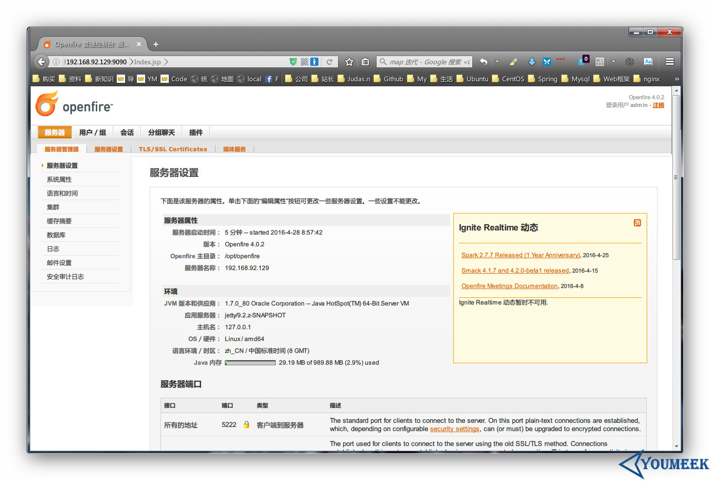

## 使用 Spark 客户端

- Spark 是一个类似 QQ 的 IM 软件，只是功能比较简单。
- 官网下载：<http://www.igniterealtime.org/downloads/index.jsp>
- 官网 Windows 下有两个版本：
	- **spark_2_7_7.exe** Offline installation, includes Java JRE (推荐安装这个，即使你有本机已经有了 JDK 环境) 
	- **spark_2_7_7_online.exe** Online installation, does not include Java JRE
- 安装完 Spark，启动软件，更玩 QQ 一样道理，具体看下图。你可以用 Spark 登录 Admin 账号。
- 
- 
- 现在访问 Web 管理界面，给所有在线的会员发个消息，如果你的 Spark 可以收到消息，那就说明整个环境是通的。
- 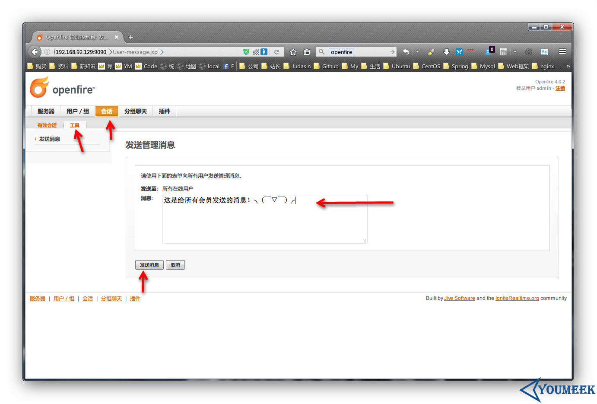
- 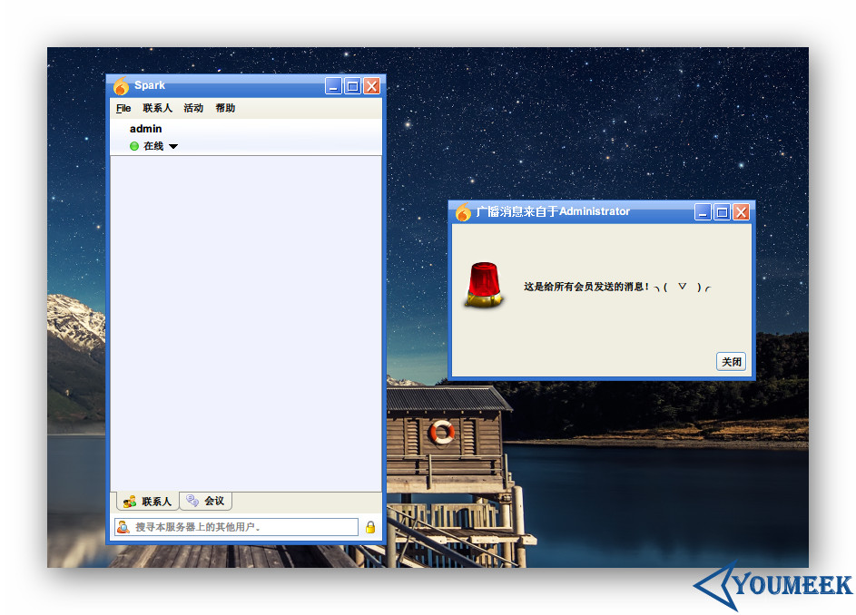
