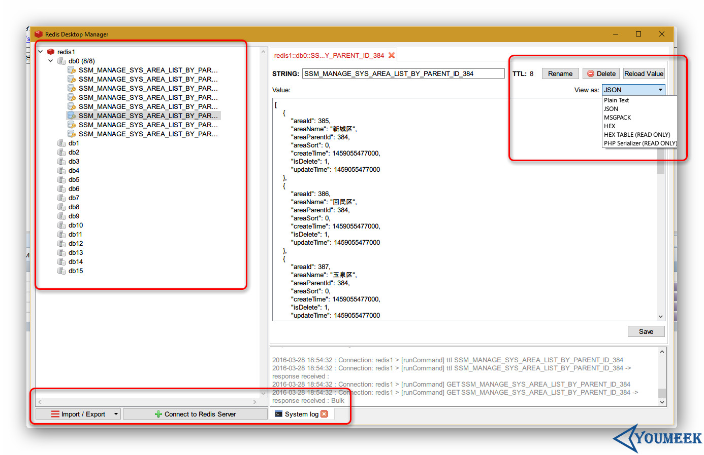

## Redis 安装和配置


## Redis 安装

- Redis 安装
    - 官网：<http://redis.io/>
    - 官网下载：<http://redis.io/download>
    - 官网 Github 地址：<https://github.com/redis>
    - 此时（20160212） Redis 最新稳定版本为：**3.0.7**
    - 官网帮助中心：<http://redis.io/documentation>
    - 我个人习惯 `/opt` 目录下创建一个目录 `setups` 用来存放各种软件安装包；在 `/usr` 目录下创建一个 `program` 用来存放各种解压后的软件包，下面的讲解也都是基于此习惯
    - 我个人已经使用了第三方源：`EPEL、RepoForge`，如果你出现 `yum install XXXXX` 安装不成功的话，很有可能就是你没有相关源，请查看我对源设置的文章
    - Redis 下载：`wget http://download.redis.io/releases/redis-3.0.7.tar.gz` （大小：1.4 M）
        - 安装依赖包：`yum install -y gcc-c++ tcl`
        - 解压：`tar zxvf redis-3.0.7.tar.gz`
        - 移动到我个人安装目录：`mv redis-3.0.7/ /usr/program/`
        - 进入解压后目录：`cd /usr/program/redis-3.0.7/`
        - 编译：`make`
        - 编译安装：`make install`
            - 安装完之后会在：`/usr/local/bin` 目录下生成好几个 redis 相关的文件
        - 复制配置文件：`cp /usr/program/redis-3.0.7/redis.conf /etc/`
        - 修改配置：`vim /etc/redis.conf`
            - 把旧值：`daemonize no` 
            - 改为新值：`daemonize yes` 
        - 启动：`/usr/local/bin/redis-server /etc/redis.conf`
        - 查看是否启动：`ps -ef | grep redis`
        - 进入客户端：`redis-cli`
        - 关闭客户端：`redis-cli shutdown`
        - 开机启动配置：`echo "/usr/local/bin/redis-server /etc/redis.conf" >> /etc/rc.local`
        - 开放防火墙端口：
            - 添加规则：`sudo iptables -I INPUT -p tcp -m tcp --dport 6379 -j ACCEPT`
            - 保存规则：`sudo /etc/rc.d/init.d/iptables save`
            - 重启 iptables：`sudo service iptables restart`


## Redis 配置

- 编辑配置文件：`vim /usr/program/redis-3.0.7/redis.conf`
- Redis 默认的配置文件内容：

``` ini
# 是否以后台daemon方式运行，默认是 no，一般我们会改为 yes
daemonize no
pidfile /var/run/redis.pid
port 6379
tcp-backlog 511
timeout 0
tcp-keepalive 0
loglevel notice
logfile ""
# 开启数据库的数量，Redis 是有数据库概念的，默认是 16 个，数字从 0 ~ 15
databases 16
save 900 1
save 300 10
save 60 10000
stop-writes-on-bgsave-error yes
rdbcompression yes
rdbchecksum yes
dbfilename dump.rdb
dir ./
slave-serve-stale-data yes
slave-read-only yes
repl-diskless-sync no
repl-diskless-sync-delay 5
repl-disable-tcp-nodelay no
slave-priority 100
appendonly no
appendfilename "appendonly.aof"
appendfsync everysec
no-appendfsync-on-rewrite no
auto-aof-rewrite-percentage 100
auto-aof-rewrite-min-size 64mb
aof-load-truncated yes
lua-time-limit 5000
slowlog-log-slower-than 10000
slowlog-max-len 128
latency-monitor-threshold 0
notify-keyspace-events ""
hash-max-ziplist-entries 512
hash-max-ziplist-value 64
list-max-ziplist-entries 512
list-max-ziplist-value 64
set-max-intset-entries 512
zset-max-ziplist-entries 128
zset-max-ziplist-value 64
hll-sparse-max-bytes 3000
activerehashing yes
client-output-buffer-limit normal 0 0 0
client-output-buffer-limit slave 256mb 64mb 60
client-output-buffer-limit pubsub 32mb 8mb 60
hz 10
aof-rewrite-incremental-fsync yes
```


## Redis 常用命令

- 命令是不区分大小写的，但是这里为了方便和后面的 key value 进行区分所以我全部写大写，你也可以用小写。
    - 但是需要注意的是：key 是完全区分大小写的，比如 key=codeBlog 和 key=codeblog 是两个键值
- 官网命令列表：<http://redis.io/commands>
- `SET key value`，设值。eg：`SET myblog www.youmeek.com`
- `GET key`，取值
- `INCR key`，递增数字
- `DECR key`，递减数字
- `KEYS *`，查看当前数据库下所有的 key
- `APPEND key value`，给尾部追加内容，如果要追加的 key 不存在，则相当于 SET key value
- `STRLEN key`，返回键值的长度，如果键不存在则返回 0
- `MSET key1 value1 key2 value2`，同时设置多值
- `MGET key1 value1 key2 value2`，同时取多值
- `EXPIRE key 27`，设置指定键的生存时间，27 的单位是秒
- `TTL key`，查看键的剩余生存时间
    - 返回 -2，表示不存在，过了生存时间后被删除
    - 返回 -1，表示没有生存时间，永久存储
    - 返回正整数，表示还剩下对应的生存时间
- `PERSIST key`，清除生成时间，重新变成永久存储（重新设置 key 的值也可以起到清除生存时间的效果）
- `FLUSHDB`，清空当前数据库所有键值
- `FLUSHALL`，清空所有数据库的所有键值


## Redis 客户端

- Java：<http://redis.io/clients#java>
    - Jedis 官网：<https://github.com/xetorthio/jedis>


## Redis GUI 管理工具

- Redis Desktop Manager
    - 官网：<http://redisdesktop.com/>
    - 官网下载：<http://redisdesktop.com/download>
    - 效果如下图：
    - 


## Redis 主从（主从从）配置

### Redis 主从架构

- 假设有两台服务器，一台做主，一台做从
    - Redis 主信息：
        - IP：**12.168.1.114**=
        - 端口：**6379**
    - Redis 从信息：
        - IP：**12.168.1.115**
        - 端口：**6379**
- 编辑从机的 Redis 配置文件，找到 210 行（大概），默认这一行应该是注释的：`# slaveof <masterip> <masterport>`
- 我们需要去掉该注释，并且填写我们自己的主机的 IP 和 端口，比如：`slaveof 192.168.1.114 6379`
- 配置完成后重启从机 Redis 服务
- 重启完之后，进入主机的 redis-cli 状态下，输入：`INFO replication`
    - 可以查询到当前主机的 redis 处于什么角色，有哪些从机已经连上主机。
- 此时已经完成了主从配置，我们可以测试下：
    - 我们进入主机的 redis-cli 状态，然后 set 某个值，比如：`set myblog YouMeek.com`
- 我们切换进入从机的 redis-cli 的状态下，获取刚刚设置的值看是否存在：`get myblog`，此时，我们可以发现是可以获取到值的。
- 但是有一个需要注意的：从库不具备写入数据能力，不然会报错。 从库只有只读能力。


### Redis主从从架构

- Redis 主从从的意思：看桌面上的截图。
- 优点，除了减少主库连接的压力，还有可以关掉主库的持久化功能，把持久化的功能交给从库进行处理。
- 第一个从库配置的信息是连上主库，后面的第二个从库配置的连接信息是连上第一个从库， 假如还有第三个从库的话，我们可以把第三个从库的配置信息连上第二个从库上，以此类推。


## 资料

- <http://yanshisan.blog.51cto.com/7879234/1377992>
- <https://segmentfault.com/a/1190000002685224>
- <http://itbilu.com/linux/management/4kB2ninp.html>
- <http://keenwon.com/1335.html>