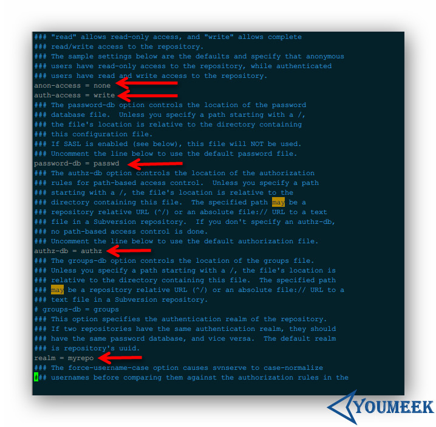
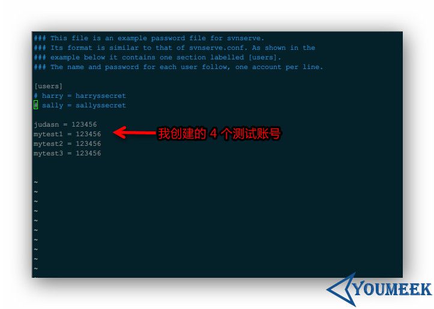
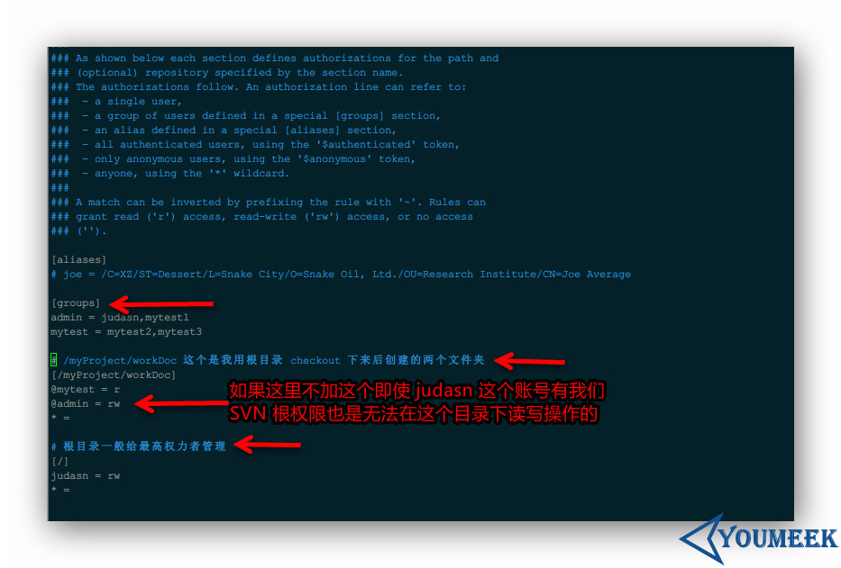
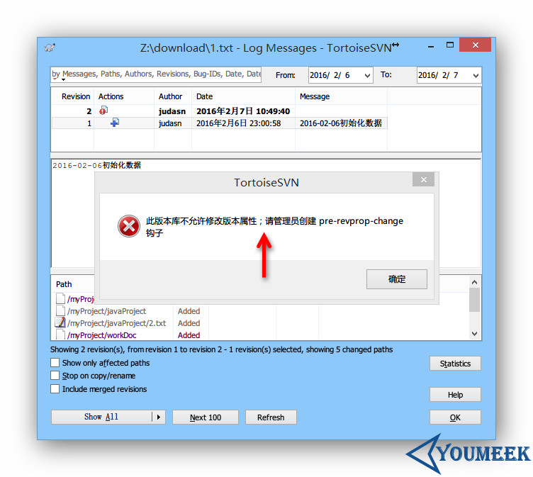

# Subversion 1.8 安装

## RPM 安装（推荐）

- wandisco 整理的 RPM 文件官网：<http://opensource.wandisco.com/centos/6/svn-1.8/RPMS/x86_64/>
- 下载下面几个 RPM 文件：
    - 创建目录来保存下载的 RPM：`sudo mkdir -p /opt/setups/subversion/ ; cd /opt/setups/subversion/`
    - `wget http://opensource.wandisco.com/centos/6/svn-1.8/RPMS/x86_64/mod_dav_svn-1.8.15-1.x86_64.rpm`
    - `wget http://opensource.wandisco.com/centos/6/svn-1.8/RPMS/x86_64/serf-1.3.7-1.x86_64.rpm`
    - `wget http://opensource.wandisco.com/centos/6/svn-1.8/RPMS/x86_64/subversion-1.8.15-1.x86_64.rpm`
    - `wget http://opensource.wandisco.com/centos/6/svn-1.8/RPMS/x86_64/subversion-gnome-1.8.15-1.x86_64.rpm`
    - `wget http://opensource.wandisco.com/centos/6/svn-1.8/RPMS/x86_64/subversion-javahl-1.8.15-1.x86_64.rpm`
    - `wget http://opensource.wandisco.com/centos/6/svn-1.8/RPMS/x86_64/subversion-perl-1.8.15-1.x86_64.rpm`
    - `wget http://opensource.wandisco.com/centos/6/svn-1.8/RPMS/x86_64/subversion-python-1.8.15-1.x86_64.rpm`
    - `wget http://opensource.wandisco.com/centos/6/svn-1.8/RPMS/x86_64/subversion-tools-1.8.15-1.x86_64.rpm`
    - 如果上面的 RPM 链接失效，你也可以考虑下载我提供的百度云盘地址：<http://pan.baidu.com/s/1pKnGia3>
    
    
- 安装下载的 RPM 文件：
    - `sudo rpm -ivh *.rpm`

- 检查安装后的版本：
    - `svn --version`

## 编译安装（不推荐）

- subversion 1.8 编译安装（本人没有尝试成功，所以不推荐，下面内容只供参考）
    - 官网安装说明（查找关键字 `Dependency Overview`）：<http://svn.apache.org/repos/asf/subversion/trunk/INSTALL>
    - 此时 1.8 最新版本为：`subversion-1.8.15.tar.gz`
    - 我个人习惯 `/opt` 目录下创建一个目录 `setups` 用来存放各种软件安装包；在 `/usr` 目录下创建一个 `program` 用来存放各种解压后的软件包，下面的讲解也都是基于此习惯
    - 我个人已经使用了第三方源：`EPEL、RepoForge`，如果你出现 `yum install XXXXX` 安装不成功的话，很有可能就是你没有相关源，请查看我对源设置的文章
    - 安装编译所需工具：
        - `sudo yum install -y gcc gcc-c++ autoconf libtool `
    - 所需依赖包说明：
        - （必要包）apr 和 apr-util 官网地址：<http://archive.apache.org/dist/apr/>
        - （必要包）zlib 官网地址：<ttp://www.zlib.net/>
        - （必要包）SQLite 官网地址：<http://www.sqlite.org/download.html>
        - （必要包）Subversion 官网地址：<https://subversion.apache.org/download.cgi>
    - 所需依赖包下载：
        - apr 下载：`wget http://archive.apache.org/dist/apr/apr-1.5.2.tar.gz`
        - apr-util 下载：`wget http://archive.apache.org/dist/apr/apr-util-1.5.4.tar.gz`
        - zlib 下载：`wget http://zlib.net/zlib-1.2.8.tar.gz`
        - SQLite 下载：`wget http://www.sqlite.org/2016/sqlite-amalgamation-3100200.zip`
        - Subversion 下载：`wget http://apache.fayea.com/subversion/subversion-1.8.15.tar.gz`
    - 安装依赖包：    
        - apr 安装：
            - 解压：`tar -zxvf apr-1.5.2.tar.gz`
            - 移动到我个人习惯的安装目录下：`mv apr-1.5.2/ /usr/program/`
            - 标准的 GNU 源码安装方式：
                - `cd /usr/program/apr-1.5.2`
                - `./configure`
                - `make`
                - `make install`
            - 安装完得到安装的配置路径：`/usr/local/apr/bin/apr-1-config`，这个需要记下来，下面会用到
        - apr-util 安装：
            - 解压：`tar -zxvf apr-util-1.5.4.tar.gz`
            - 移动到我个人习惯的安装目录下：`mv apr-util-1.5.4/ /usr/program/`
            - 标准的 GNU 源码安装方式：
                - `cd /usr/program/apr-util-1.5.4/`
                - `./configure  --with-apr=/usr/local/apr/bin/apr-1-config`
                - `make`
                - `make install`
            - 安装完得到安装的配置路径：`/usr/local/apr/bin/apu-1-config`，这个需要记下来，下面会用到
        - zlib 安装：
            - 解压：`tar -zxvf zlib-1.2.8.tar.gz`
            - 移动到我个人习惯的安装目录下：`mv zlib-1.2.8/ /usr/program/`
            - 标准的 GNU 源码安装方式：
                - `cd /usr/program/zlib-1.2.8/`
                - `./configure`
                - `make`
                - `make install`
        - Subversion 解压：
            - 解压：`tar -zxvf subversion-1.8.15.tar.gz`
            - 移动到我个人习惯的安装目录下：`mv subversion-1.8.15/ /usr/program/`
        - SQLite 安装：
            - 解压：`unzip sqlite-amalgamation-3100200.zip`
            - 移动到 subversion 目录下：`mv sqlite-amalgamation-3100200/ /usr/program/subversion-1.8.15/`
        - Subversion 安装：
            - 标准的 GNU 源码安装方式：
                - `cd /usr/program/subversion-1.8.15/`
                - `./configure --prefix=/usr/local/subversion --with-apr=/usr/local/apr/bin/apr-1-config  --with-apr-util=/usr/local/apr/bin/apu-1-config`
                - `make`
                - `make install`
                
                
## SVN 配置

- 在系统上创建一个目录用来存储所有的 SVN 文件：`mkdir -p /opt/svn/repo/`
- 新建一个版本仓库：`svnadmin create /opt/svn/repo/`
    - 生成如下目录和文件：
        - 目录：`locks`
        - 目录：`hooks`
        - 目录：`db`
        - 目录：`conf`
        - 文件：`format`
        - 文件：`README.txt`
    - 其中，目录 `conf` 最为重要，常用的配置文件都在里面
        - `svnserve.conf` 是 svn 服务综合配置文件
        - `passwd` 是用户名和密码配置文件
        - `authz` 是权限配置文件

- 设置配置文件
    - 编辑配置文件：`vim /opt/svn/repo/conf/svnserve.conf`
    - 
    - 配置文件中下面几个参数（默认是注释的）：
        - `anon-access`： 对不在授权名单中的用户访问仓库的权限控制，有三个可选性：`write、read、none`
            - `none` 表示没有任何权限
            - `read` 表示只有只读权限
            - `write` 表示有读写权限
        - `auth-access`：对在授权名单中的用户访问仓库的权限控制，有三个可选性：`write、read、none`
            - `none` 表示没有任何权限
            - `read` 表示只有只读权限
            - `write` 表示有读写权限
        - `password-db`：指定用户数据配置文件
        - `authz-db`：指定用户权限配置文件
        - `realm`：指定版本库的认证域，即在登录时提示的认证域名称。若两个版本库的认证域相同，建议使用相同的用户名口令数据文件
            - 当前实例的配置内容：`realm = myrepo`

- 添加用户
    - 编辑配置文件：`vim /opt/svn/repo/conf/passwd`
    - 
    - 添加用户很简答，如上图所示在配置文中添加一个格式为：`用户名 = 密码`  的即可

- 设置用户权限
    - 编辑配置文件：`vim /opt/svn/repo/conf/authz`
    - 
    - 配置文件中几个参数解释：
        - `r` 表示可写
        - `w` 表示可读
        - `rw` 表示可读可写
        - `* =` 表示除了上面设置的权限用户组以外，其他所有用户都设置空权限，空权限表示禁止访问本目录，这很重要一定要加上
        - `[groups]` 表示下面创建的是用户组，实际应用中一般我们对使用者都是进行分组的，然后把权限控制在组上，这样比较方便。使用组权限方式：`@组名 = rw` 

- 启动服务
    - `svnserve -d -r /opt/svn/repo/ --listen-port 3690`
        - `-d` 表示后台运行
        - `-r /opt/svn/repo/` 表示指定根目录
        - `--listen-port 3690` 表示指定端口，默认就是 3690，所以如果要用默认端口这个也是可以省略掉的

- 停止服务
    - `killall svnserve`
    
    
- 测试
    - iptables 处理
        - 一种方式：先关闭 iptables，防止出现拦截问题而测试不了：`service iptables stop`
        - 一种方式：在 iptables 中添加允许规则（svn 默认端口是 3690）：
            - 添加规则：`sudo iptables -I INPUT -p tcp -m tcp --dport 3690 -j ACCEPT`
            - 保存规则：`sudo /etc/rc.d/init.d/iptables save`
            - 重启 iptables：`sudo service iptables restart`
    - 在 Windows 的 svn 客户端上访问:`svn://192.168.0.110`

## SVN 设置提交之后可修改提交的 Message 信息

- 默认的 SVN 是无法修改提交后的 Message 信息的，修改会报如下错误：
- 
- 解决办法：
    - 下载我 hooks 文件：<http://pan.baidu.com/s/1c1jtlmw>
    - 把 pre-revprop-change 文件放在你的仓库下，比如我仓库地址是：`/opt/svn/repo/hooks`
        - 编辑该文件：`vim /opt/svn/repo/hooks/pre-revprop-change`
        - 把文件尾巴的这句脚本：`echo "$1 $2 $3 $4 $5" >> /opt/svn/repo/logchanges.log`，改为：`echo "$1 $2 $3 $4 $5" >> /你的仓库地址/logchanges.log`
        - 你在该目录下也可以看到一个文件 `pre-revprop-change.tmpl`，这个其实就是 svn 提供给你模板，其他的那些你有兴趣也可以研究下

## 资料

- <http://tecadmin.net/install-subversion-1-8-on-centos-rhel/>
- <http://svn.apache.org/repos/asf/subversion/trunk/INSTALL>
- <http://chenpipi.blog.51cto.com/8563610/1613007>
- <https://blog.linuxeye.com/348.html>
- <http://jingyan.baidu.com/article/046a7b3efb6a5df9c27fa991.html>
- <http://www.ha97.com/4467.html>
- <http://blog.feehi.com/linux/7.html>
- <http://my.oschina.net/lionel45/blog/298305?fromerr=1NdIndN0>
- <http://www.centoscn.com/CentosServer/ftp/2015/0622/5708.html>
- <http://blog.csdn.net/tianlesoftware/article/details/6119231>
- <http://www.scmeye.com/thread-419-1-1.html>
- <http://m.blog.csdn.net/article/details?id=7908907>
- 设置可编辑提交信息：<http://stackoverflow.com/questions/692851/can-i-go-back-and-edit-comments-on-an-svn-checkin>