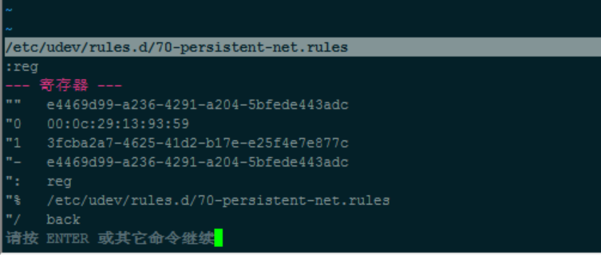

# Vim 安装和配置、优化

## Vim 介绍

- Vim 官网：<http://www.vim.org/>

## Vim 安装

- CentOS：`sudo yum install -y vim`
- Ubuntu：`sudo apt-get install -y vim`
- Windows GVim 下载：<http://www.xiazaiba.com/html/3347.html>

## Vim 配置（CentOS 环境）

- 编辑配置文件是：`sudo vim /etc/vimrc`

## Vim 基础快捷键

- 注意
    - 严格区分字母大小写
    - 含有 `Ctrl` 字眼都表示 Ctrl 键盘按钮
    - 特定符号需要配合 Shift 键，比如字母键盘区上面的数字区：!@#%%^&*()
    - 要按出冒号键 `:` 也是需要 Shift 的
- 移动
    - `j`，下
    - `k`，上
    - `h`，左
    - `l`，右
    - `v`，按 v 之后按方向键可以选中你要选中的文字
    - `gg`，跳到第 1 行
    - `G`，跳到第最后行
    - `16G` 或 `:16`，跳到第 16 行
    - `$`，到本行 **行尾**
    - `0`，到本行 **行头**
    - `w`，到下一个单词的 **开头**
    - `e`，到下一个单词的 **结尾**
    - `Ctrl + u`，向文件 **首翻** 半屏
    - `Ctrl + d`，向文件 **尾翻** 半屏
    - `Ctrl + f`，向文件 **尾翻** 一屏
    - `Ctrl + b`，向文件 **首翻** 一屏 
    - `*`，匹配光标当前所在的单词，移动光标到 **下一个** 匹配单词
    - `#`，匹配光标当前所在的单词，移动光标到 **上一个** 匹配单词
    - `^`，到本行第一个单词头
    - `g_`，到本行最后一个单词尾巴
    - `%`，匹配括号移动，包括 **(、{、[**
- 插入
    - `I`，在当前 **行首** 插入
    - `A`，在当前 **行尾** 插入
    - `i`，在当前字符的 **左边** 插入
    - `a`，在当前字符的 **右边** 插入
    - `o`，在当前行 **下面** 插入一个新行
    - `O`，在当前行 **上面** 插入一个新行
- 编辑
    - 删除
        - `x`，删除 **光标后** 的 1 个字符
        - `2x`，删除 **光标后** 的 2 个字符
        - `X`，删除 **光标前** 的 1 个字符
        - `2X`，删除 **光标前** 的 2 个字符
        - `dd`，删除当前行
        - `cc`，删除当前行后进入 insert 模式
        - `dw`，删除当前光标下的单词/空格
        - `d$`，删除光标至 **行尾** 所有字符
        - `dG`，删除光标至 **文件尾** 所有字符
        - `3dd`，从当前光标开始，删掉 3 行
    - 复制
        - `y`，复制光标所选字符
        - `yw`，复制光标后单词
        - `yy`，复制当前行
        - `4yy`，复制当前行及下面 4 行
        - `y$`，复制光标位置至 **行尾** 的内容
        - `y^`，复制光标位置至 **行首** 的内容
    - 粘贴
        - `p`，将粘贴板中内容复制到 **光标之后**
        - `P`，将粘贴板中内容复制到 **光标之前**
    - 其他
	    - `ddp`，交换当前光标所在行和下一行的位置
	    - `u`，撤销
	    - `:wq`，退出并 **保存**
	    - `:q!`，退出并 **不保存**
	    - `Ctrl + v`，进入 Vim 列编辑
	    - `guu`，把当前行的字母全部转换成 **小写**
	    - `gUU`，把当前行的字母全部转换成 **大写**
	    - `g~~`，把当前行的字母是大写的转换成小写，是小写的转换成大写
	    - `:saveas /opt/setups/text.txt`，另存到 /opt/setups/text.txt
- 搜索
    - `/YouMeek`，从光标开始处向文件尾搜索 YouMeek 字符，按 `n` 继续向下找，按 `N` 继续向上找
    - `?YouMeek`，从光标开始处向文件首搜索 YouMeek 字符，按 `n` 继续向下找，按 `N` 继续向上找
- 替换
    - `:%s/YouMeek/Judasn/g`，把文件中所有 YouMeek 替换为：Judasn
    - `:%s/YouMeek/Judasn/`，把文件中所有行中第一个 YouMeek 替换为：Judasn
    - `:s/YouMeek/Judasn/`，把光标当前行第一个 YouMeek 替换为 Judasn
    - `:s/YouMeek/Judasn/g`，把光标当前行所有 YouMeek 替换为 Judasn
    - `:s#YouMeek/#Judasn/#`，除了使用斜杠作为分隔符之外，还可以使用 # 作为分隔符，此时中间出现的 / 不会作为分隔符，该命令表示：把光标当前行第一个 YouMeek/ 替换为 Judasn/
    - `:10,31s/YouMeek/Judasng`，把第 10 行到 31 行之间所有 YouMeek 替换为 Judasn

## Vim 的特殊复制、黏贴

- Vim 提供了 12 个剪贴板，分别是：`0,1,2,3,4,5,6,7,8,9,a,"`，默认采用的是 `"`，也就是双引号，可能你初读感觉很奇怪。你可以用 Vim 编辑某个文件，然后输入：`:reg`。你可以看到如下内容：
	- 
- 复制到某个剪切板的命令：`"7y`，表示使用 7 号剪切板。
- 黏贴某个剪切板内容：`"7p`，表示使用 7 号剪切板内容进行黏贴

## Vim 配置

- 我个人本地不使用 Vim 的，基本上都是在操作服务器的时候使用，所以这里推荐这个配置文件
	- [vim-for-server](https://github.com/wklken/vim-for-server)
	- 在假设你已经备份好你的 Vim 配置文件后，使用该配置文件：`curl https://raw.githubusercontent.com/wklken/vim-for-server/master/vimrc > ~/.vimrc`
	- 效果如下：
		- 

## 资料

- [vim几个小技巧（批量替换，列编辑）](http://blogread.cn/it/article/1010?f=sa)
- [最佳vim技巧](http://www.2maomao.com/blog/wp-content/uploads/vim_tips.txt)
- [简明 Vim 练级攻略](http://coolshell.cn/articles/5426.html)
- [vim 批量查找替换](http://blog.csdn.net/wangchong0/article/details/6801956)
