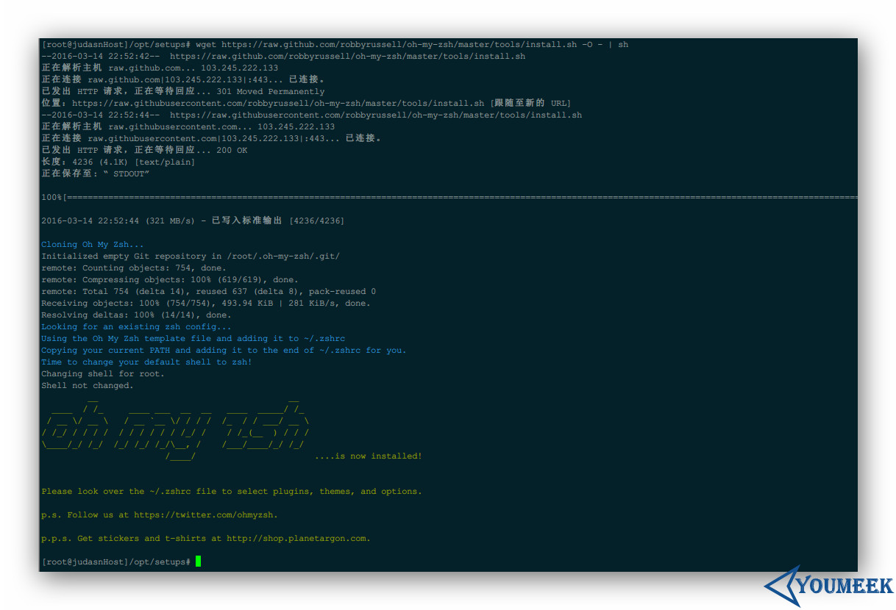
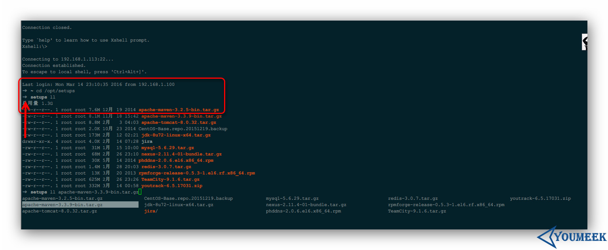
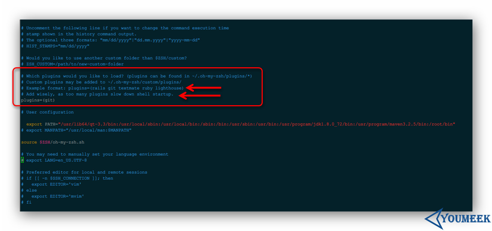

# Zsh 入门


## 本文前提

- CentOS 6.7 64 bit
- root 用户


## Zsh 介绍

- Zsh 兼容 Bash，据传说 99% 的 Bash 操作 和 Zsh 是相同的
- Zsh 官网：<http://www.zsh.org/>
- 先看下你的 CentOS 支持哪些 shell：`cat /etc/shells`，正常结果应该是这样的：

``` bash
/bin/sh
/bin/bash
/sbin/nologin
/bin/dash
/bin/tcsh
/bin/csh
```

- 默认 CentOS / Ubuntu / Mac 系统用的是 Bash，倒也不是说 Bash 不好，而是说我们有更好的选择。


## Zsh 安装

- CentOS 安装：`sudo yum install -y zsh`
- Ubuntu 安装：`sudo apt-get install -y zsh`
- 在检查下系统的 shell：`cat /etc/shells`，你会发现多了一个：`/bin/zsh`


## 使用 Zsh 扩展集合：oh-my-zsh

- oh-my-zsh 帮我们整理了一些常用的 Zsh 扩展功能和主题：<https://github.com/robbyrussell/oh-my-zsh>
- 我们无需自己去捣搞 Zsh，直接用 oh-my-zsh 就足够了，如果你想继续深造的话那再去弄。
- 先安装 git：`sudo yum install -y git`
- 安装 oh-my-zsh（这个过程可能会有点慢，或者需要重试几次）：`wget https://raw.github.com/robbyrussell/oh-my-zsh/master/tools/install.sh -O - | sh`
- 整个过程效果如下图：
    - 
- 在以 root 用户为前提下，oh-my-zsh 的安装目录：**/root/.oh-my-zsh**
- 在以 root 用户为前提下，Zsh 的配置文件位置：**/root/.zshrc**
- 为 root 用户设置 zsh 为系统默认 shell：`chsh -s /bin/zsh root`
- 如果你要重新恢复到 bash：`chsh -s /bin/bash root`
- 现在你关掉终端或是重新连上 shell，现在开头是一个箭头了，如下图：
    - 


## Zsh 配置

### 插件

- 启用 oh-my-zsh 中自带的插件。
- oh-my-zsh 的插件列表介绍（太长了，用源码不精准地统计下有 149 个）：<https://github.com/robbyrussell/oh-my-zsh/wiki/Plugins>
- 我们看下安装 oh-my-zsh 的时候自带有多少个插件：`ls -l /root/.oh-my-zsh/plugins |grep "^d"|wc -l`，我这边得到的结果是：211
- 编辑配置文件：`vim /root/.zshrc`，找到下图的地方，怎么安装，原作者注释写得很清楚了，别装太多了，默认 git 是安装的。
    - 
- 插件推荐：
    - `wd`
        - 简单地讲就是给指定目录映射一个全局的名字，以后方便直接跳转到这个目录，比如：
        - 编辑配置文件，添加上 wd 的名字：`vim /root/.zshrc`
        - 我常去目录：**/opt/setups**，每次进入该目录下都需要这样：`cd /opt/setups`
        - 现在用 wd 给他映射一个快捷方式：`cd /opt/setups ; wd add setups`
        - 以后我在任何目录下只要运行：`wd setups` 就自动跑到 /opt/setups 目录下了
        - 插件官网：<https://github.com/mfaerevaag/wd>
    - `autojump`
        - 这个插件会记录你常去的那些目录，然后做一下权重记录，你可以用这个命令看到你的习惯：`j --stat`，如果这个里面有你的记录，那你就只要敲最后一个文件夹名字即可进入，比如我个人习惯的 program：`j program`，就可以直接到：`/usr/program`
        - 插件官网：<https://github.com/wting/autojump>
        - 官网插件下载地址：<https://github.com/wting/autojump/downloads>
        - 插件下载：`wget https://github.com/downloads/wting/autojump/autojump_v21.1.2.tar.gz`
        - 解压：`tar zxvf autojump_v21.1.2.tar.gz`
        - 进入解压后目录并安装：`cd autojump_v21.1.2/ ; ./install.sh`
        - 再执行下这个：`source /etc/profile.d/autojump.sh`
        - 编辑配置文件，添加上 autojump 的名字：`vim /root/.zshrc`
    - `zsh-syntax-highlighting`
        - 这个插件会记录你常去的那些目录，然后做一下权重记录，你可以用这个命令看到你的习惯：`j --stat`，如果这个里面有你的记录，那你就只要敲最后一个文件夹名字即可进入，比如我个人习惯的 program：`j program`，就可以直接到：`/usr/program`
        - 插件官网：<https://github.com/zsh-users/zsh-syntax-highlighting>
        - 安装，复制该命令：'git clone https://github.com/zsh-users/zsh-syntax-highlighting.git ${ZSH_CUSTOM:-~/.oh-my-zsh/custom}/plugins/zsh-syntax-highlighting'
		- 编辑：`vim ~/.zshrc`，找到这一行，后括号里面的后面添加：`plugins=( 前面的一些插件名称 zsh-syntax-highlighting)`
		- 刷新下配置：`source ~/.zshrc`

### 主题

- 很多人喜欢捣搞这个 ╮(￣▽￣)╭
- 捣搞主题和插件思路一样
- oh-my-zsh 的主题列表介绍（还是太长了）：<https://github.com/robbyrussell/oh-my-zsh/wiki/Themes>
- 我们看下安装 oh-my-zsh 的时候，自带有多少个：`ls -l /root/.oh-my-zsh/themes |grep "^-"|wc -l`，我这边得到的结果是：140
- 我个人品味地推荐的是（排名有先后）：
    - `ys`
    - `agnoster`
    - `avit`
    - `blinks`
- 编辑配置文件：`vim /root/.zshrc`，找到下图的地方，怎么安装，原作者注释写得很清楚了，如果你没特别的喜欢那就选择随机吧。
    - 
- 配置好新主题需要重新连接 shell 才能看到效果


## 一些人性化功能

- 呃，这个其实可以不用讲的，你自己用的时候你自己会发现的，各种便捷，特别是用 Tab 多的人一定会有各种惊喜的。


## 差异

- 我们现在增加系统变量在：/etc/profile 后，输入命令：source /etc/profile 之后，重启服务器发现刚刚的系统变量现在没效果。
    - 解决办法：`vim ~/.zshrc`，在该配置文件里面增加一行：`source /etc/profile`，然后刷新 zsh 的配置：`source ~/.zshrc`。


## 资料

- <http://macshuo.com/?p=676>
- <https://aaaaaashu.gitbooks.io/mac-dev-setup/content/iTerm/zsh.html>
- <http://hackerxu.com/2014/11/19/ZSH.html>
- <https://blog.phpgao.com/oh-my-zsh.html>
- <http://www.bkjia.com/Linuxjc/1033947.html>
- <http://swiftcafe.io/2015/10/31/cafe-time-omz/>
- <http://swiftcafe.io/2015/12/04/omz-plugin/>
- <http://www.hackbase.com/article-206940-1.html>
- <http://hahack.com/wiki/shell-zsh.html>
- <http://blog.jobbole.com/86820/>
- <http://uecss.com/zsh-brew-autojump-plugins-shell-for-mac.html>
- <http://www.cnblogs.com/westfly/p/3283525.html>
