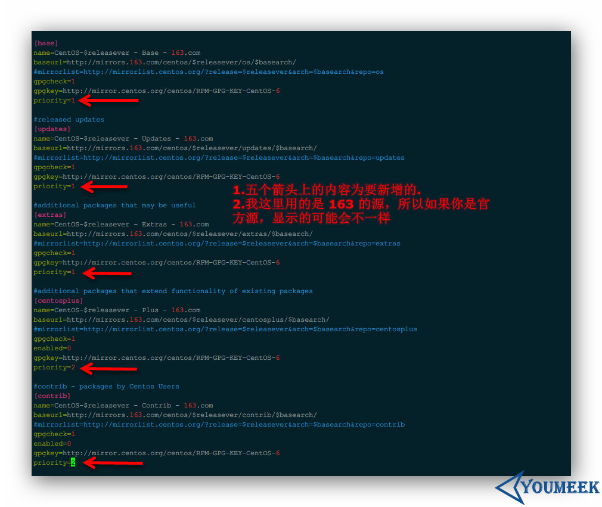
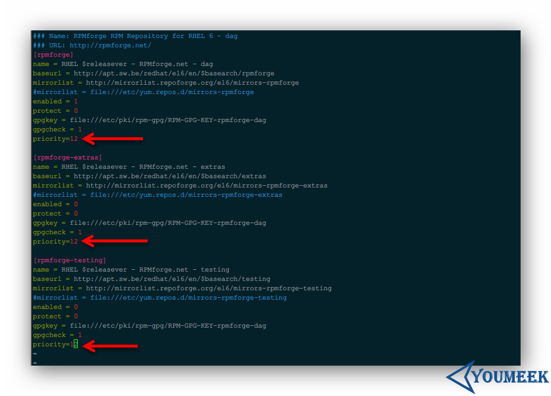

# CentOS 源设置

## 修改官方源

- 下面内容的一个简易集合版本脚本：<http://pan.baidu.com/s/1hrdnbi0>

## 修改官方源

> 国内常用源配置方法（该源和官方源是一样的，只是因为服务器在国内会起到加速作用而已）：

- 163 源：<http://mirrors.163.com/.help/centos.html> 
- 阿里源：<http://mirrors.aliyun.com/help/centos>
- sohu：<http://mirrors.sohu.com/help/centos.html>

> CentOS 6 替换过程（这里以 163 源为例）：

- 备份官网源：`sudo mv /etc/yum.repos.d/CentOS-Base.repo /etc/yum.repos.d/CentOS-Base.repo.20151219.backup`
- `cd /etc/yum.repos.d/`
- 下载对应版本 repo 文件, 放入 **/etc/yum.repos.d/**
 - 下载源文件：
    - CentOS6：`sudo wget http://mirrors.163.com/.help/CentOS6-Base-163.repo`
 - `sudo mv CentOS6-Base-163.repo CentOS-Base.repo`
 - 导入key：`rpm --import /etc/pki/rpm-gpg/RPM-GPG-KEY-CentOS-6`
 - `sudo yum clean all`
 - `sudo yum makecache`
 - `sudo yum update -y`

> CentOS 7 替换过程（这里以 163 源为例）：

- 备份官网源：`sudo mv /etc/yum.repos.d/CentOS-Base.repo /etc/yum.repos.d/CentOS-Base.repo.20170219.backup`
- `cd /etc/yum.repos.d/`
- 下载对应版本 repo 文件, 放入 **/etc/yum.repos.d/**
 - 下载源文件：
    - CentOS7：`sudo wget http://mirrors.163.com/.help/CentOS7-Base-163.repo`
 - `sudo mv CentOS7-Base-163.repo CentOS-Base.repo`
 - 导入key：`rpm --import /etc/pki/rpm-gpg/RPM-GPG-KEY-CentOS-7`
 - `sudo yum clean all`
 - `sudo yum makecache`
 - `sudo yum update -y`

## 第三方源

> 加入第三方源主要是为了 yum 下载到官方没有提供的软件，在其他社区、第三方源里面有很多的软件包，有些软件是很好用的。CentOS 可以加入多个源，所以就存在一个源的优先级问题了，设置优先级的可以使用 yum-plugin-priorities 工具。一般我是建议官方的优先级是最高的，然后才是第三方的。

- 安装 yum-plugin-priorities：
 - CentOS 4 或 CentOS 6：`sudo yum install -y yum-plugin-priorities`
 - CentOS 5：`sudo yum install -y yum-priorities`
- 安装完 yum-plugin-priorities 插件后，默认是开启的，如果要关闭可以这样设置：
 - `sudo vim /etc/yum/pluginconf.d/priorities.conf`
 - 把 enabled=1 改为 enabled=0 即可
 - 设置默认源的优先级：
 - 一般默认的源配置里面 [base], [updates], [extras]，[centosplus] 的 priority=1， [contrib] 的 priority=2，其他第三的软件源为：priority=N （推荐 N > 10，N 可以为1到99的正整数，数值越小越优先）
 - `sudo vim /etc/yum.repos.d/CentOS-Base.repo`
 - 配置内容如下图
 - 
 
- 安装 EPEL 源：
 - 官网中文材料：<https://fedoraproject.org/wiki/EPEL/zh-cn>
 - 安装命令：`sudo yum install -y epel-release`
 - CentOS 6 导入 KEY：`rpm --import /etc/pki/rpm-gpg/RPM-GPG-KEY-EPEL-6`
 - CentOS 7 导入 KEY：`rpm --import /etc/pki/rpm-gpg/RPM-GPG-KEY-EPEL-7`
 - 设置 EPEL 源的级别：`vim  /etc/yum.repos.d/epel.repo`，追加：priority=11
- 卸载 EPEL 源
 - 如果你暂时不想使用 EPEL 源的话，把 epel.repo 里的 enabled=1 改成 enabled=0 即可，如果你完全不需要了，那就直接卸载掉 `sudo rpm -e epel-release`
 
- 安装 RepoForge 源：（旧的名字为 rpmforge）
 - 官网下载 RPM包：<http://repoforge.org/use/>
 - 我是 CentOS 6.7 64 位，所以下载 EL 6 x86_64，下载 RMP 安装文件大小：12.3 KB
 - 下载命令：`wget http://pkgs.repoforge.org/rpmforge-release/rpmforge-release-0.5.3-1.el6.rf.x86_64.rpm`（我这边 wget 不下来，需要开 VPN，所以你最好有这个心理准备）
 - 安装 RPM 文件：`sudo rpm -ivh rpmforge-release-0.5.3-1.el6.rf.x86_64.rpm`
 - 导入 KEY：`sudo rpm --import /etc/pki/rpm-gpg/RPM-GPG-KEY-rpmforge-dag`
 - 设置 RepoForge 源的级别：`vim  /etc/yum.repos.d/rpmforge.repo`，设置如下图
 - 
 
- 更新包信息：
 - `sudo yum clean all`
 - `sudo yum makecache`
 - `sudo yum update -y`
 
- 测试：
 - 命令：`sudo yum check-update`
 - 看到显示的结果中包括 rpmforge 和 epel 的列表表示成功。
 - `sudo yum install -y htop`（htop 官方源是没有的，所以如果能下载下来就表示已经使用了第三方源）

> 资料：

- <https://wiki.centos.org/zh/PackageManagement/Yum/Priorities>
- <http://www.cnblogs.com/Security-Darren/p/3947952.html>
- <http://freeloda.blog.51cto.com/2033581/1260824>
- <http://www.centoscn.com/CentOS/config/2014/0920/3793.html>  
- <http://www.cnblogs.com/mchina/archive/2013/01/04/2842275.html>
- <http://www.ha97.com/2626.html>
