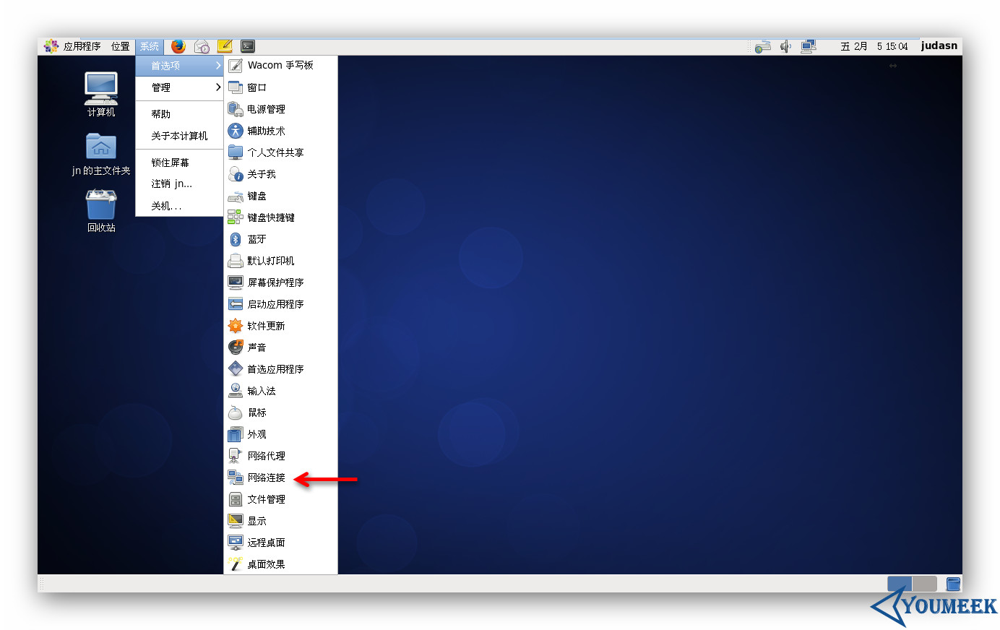
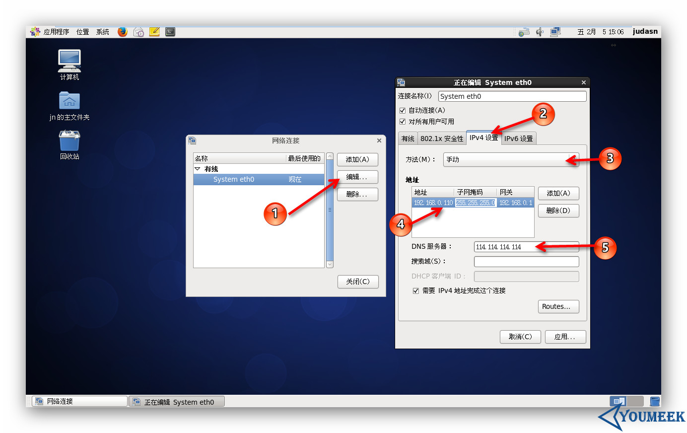

<h1 id="networkSettings0">CentOS 网络设置</h1>

------

*   [CentOS 安装](#networkSettings0)
    *   [界面化下设置网络](#networkSettings1)
    *   [命令行下设置网络](#networkSettings2)
    
------

- 由于前面虚拟机中安装 CentOS 使用的是桥接模式，为了让虚拟机中的系统能上网，我们需要进行网络设置。


<h2 id="networkSettings1">界面化下设置网络（新手推荐使用这种）</h2>

- 
 - 选择上图箭头所示
- 
 - 如上图标注 3 所示：选择 `手动` 模式
 - 如上图标注 4 所示：填写自己局域网内的子网掩码、默认网关，以及你要分配的内网 IP 地址。这三个参数你可以参考你当前使用的主机信息，在 Windows 系统上使用：`cmd --- ipconfig`，查看你当前连接的网卡信息。如果你是无线网卡则读取对应的无线网卡信息，如果你是本地连接，则读取对应的本地连接信息。 
 - 如上图标注 5 所示：填写你当前地区合适的 DNS 地址，我这边地区使用 360 测试出来的结果显示 114 的适合我，所以我这里填写该值


<h2 id="networkSettings2">命令行下设置网络</h2>

- 编辑网卡信息：
 - 备份：`cp /etc/sysconfig/network-scripts/ifcfg-eth0 /etc/sysconfig/network-scripts/ifcfg-eth0-20160205Back`
 - 把备份文件移动到其他目录：`mv /etc/sysconfig/network-scripts/ifcfg-eth0-20160205Back /opt/myBack`
 - 编辑网卡文件：`vim /etc/sysconfig/network-scripts/ifcfg-eth0`
 - 把网卡中信息改为下面对应内容：
  ```
    DEVICE=eth0  (系统默认值)
    TYPE=Ethernet  (系统默认值)
    UUID=a2c17f0c-a224-43d5-a203-48af1f0d9113  (系统默认值)
    ONBOOT=yes  (系统默认值是 no,我改为 yes)
    NM_CONTROLLED=yes  (系统默认值)
    BOOTPROTO=none   (系统默认值是 dhcp,我改为 none,代表手动)
    USERCTL=no   (自己补充的)
    IPV6INIT=no   (自己补充的)
    NETMASK=255.255.255.0  (自己补充的)
    IPADDR=192.168.0.110   (自己补充的)
    GATEWAY=192.168.0.1   (自己补充的)
    DNS1=114.114.114.114  (自己补充的)
    PREFIX=24  (使用图形界面设置后生成的)
    DEFROUTE=yes  (使用图形界面设置后生成的)
    IPV4_FAILURE_FATAL=yes  (使用图形界面设置后生成的) 
    NAME="System eth0"    (使用图形界面设置后生成的) 
    HWADDR=00:0C:29:A9:37:D4    (使用图形界面设置后生成的) 
    LAST_CONNECT=1454626679   (使用图形界面设置后生成的) 
  ```
  - 重启网络配置：`service network restart`
