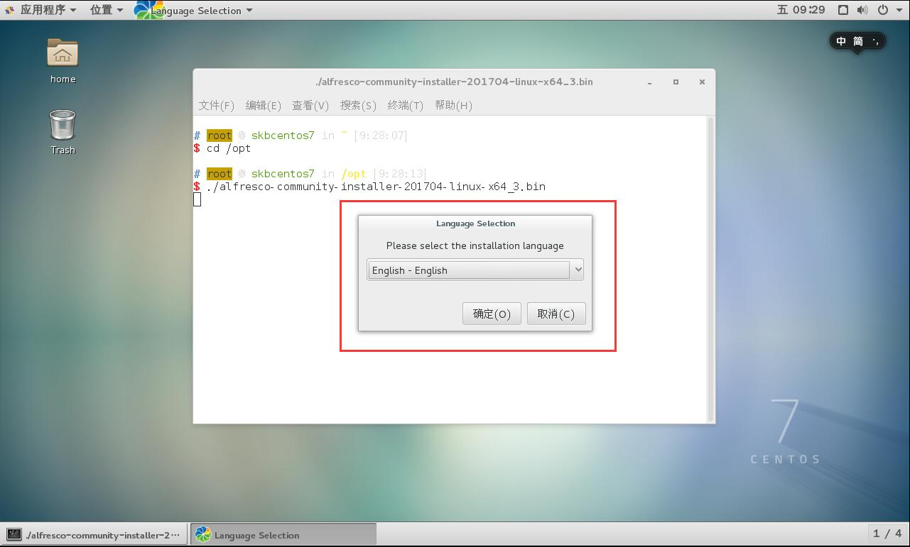
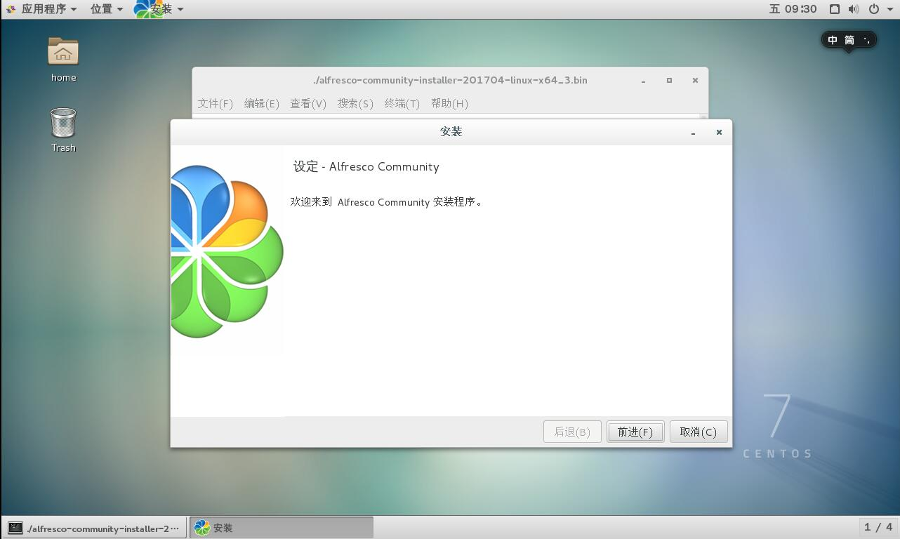
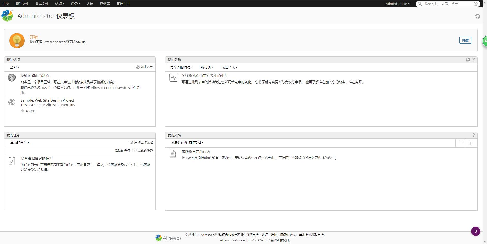

# Alfresco 使用

## Alfresco 介绍

- 官网：<https://www.alfresco.com>
- 开源社区版下载：<https://www.alfresco.com/alfresco-community-download>
- 官网文档说明：<http://docs.alfresco.com/>
- 开源社区版本安装说明：<http://docs.alfresco.com/community/concepts/master-ch-install.html>
	- Linux 版本安装说明：<http://docs.alfresco.com/community/tasks/simpleinstall-community-lin.html>
- 我的目的：用来管理公司发布的文档，比如：Word、Excel、记事本等这类，该系统支持在线预览文件。

## 环境说明

- CentOS 7.3 带有图形桌面（需要有）
- 下载下来的软件：**alfresco-community-installer-201704-linux-x64_3.bin**，大小：822M
- 安装包存放目录：/opt

## 开始安装：

- 使用 Linux 桌面方式进入系统，打开终端：
- 切换目录：`cd /opt`
- 赋予权限：`chmod +x alfresco-community-installer-201704-linux-x64_3.bin`
- `./alfresco-community-installer-201704-linux-x64_3.bin`
- 然后会出现如下图这种步骤引导安装界面，带有简体中文版，选择 `简单` 的基本流程安装方式，默认都是下一步下一步。其实选择 `高级` 也基本上是下一步下一步的，只是可以看到更多细节。
- 在设置管理员密码上，我是：123456（默认用户名是：admin）

- 安装完成后，可以选择开始启动程序。建议不勾选，我们来使用下面命令。
- 程序默认是安装在：**/opt/alfresco-community**
- 所以我们需要打开终端：
- 切换目录：`cd /opt/alfresco-community`
- 启动程序：`./alfresco.sh start`
- 停止程序：`./alfresco.sh stop`
- 启动完成后，用浏览器打开：<http://127.0.0.1:8080/share>（如果你 Linux 防火墙关闭了，也可以直接用其他机子直接访问，把这台机子当做服务器用），可以看到如下内容：

 

