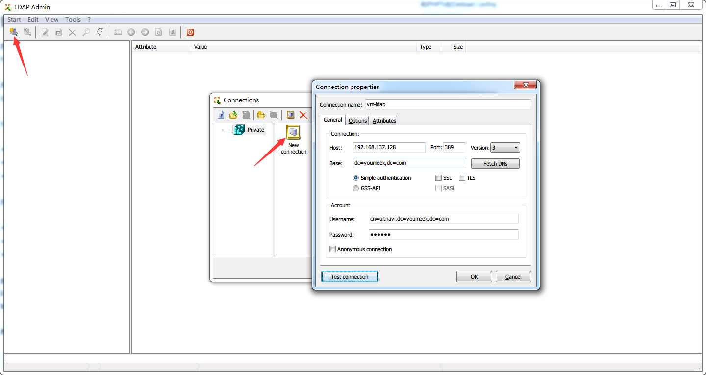

#  LDAP 安装和配置


## LDAP 基本概念

- <https://segmentfault.com/a/1190000002607140>
- <http://www.itdadao.com/articles/c15a1348510p0.html>
- <http://blog.csdn.net/reblue520/article/details/51804162>

## LDAP 服务器端安装

- 环境：CentOS 7.3 x64（为了方便，已经禁用了防火墙）
- 常见服务端：
	- [OpenLDAP](http://www.openldap.org/)
- 这里选择：OpenLDAP，安装（最新的是 2.4.40）：`yum install -y openldap openldap-clients openldap-servers migrationtools`
- 配置：
	- `cp /usr/share/openldap-servers/DB_CONFIG.example /var/lib/ldap/DB_CONFIG`
	- `chown ldap. /var/lib/ldap/DB_CONFIG`
- 启动：
	- `systemctl start slapd`
	- `systemctl enable slapd`
- 查看占用端口（默认用的是 389）：`netstat -tlnp | grep slapd`

### 设置OpenLDAP管理员密码

- 输入命令：`slappasswd`，重复输入两次明文密码后（我是：123456），我得到一个加密后密码（后面会用到）：`{SSHA}YK8qBtlmEpjUiVEPyfmNNDALjBaUTasc`
- 新建临时配置目录：
	- `mkdir /root/my_ldif ; cd /root/my_ldif`
	- `vim chrootpw.ldif`，添加如下内容：

``` ini
dn: olcDatabase={0}config,cn=config                                                                                            
changetype: modify
add: olcRootPW
olcRootPW: {SSHA}YK8qBtlmEpjUiVEPyfmNNDALjBaUTasc
```

- 添加刚刚写的配置（过程比较慢）：`ldapadd -Y EXTERNAL -H ldapi:/// -f chrootpw.ldif `
- 导入默认的基础配置（过程比较慢）：`for i in /etc/openldap/schema/*.ldif; do ldapadd -Y EXTERNAL -H ldapi:/// -f $i; done`

### 修改默认的domain

- 输入命令：`slappasswd`，重复输入两次明文密码后（我是：111111），我得到一个加密后密码（后面会用到）：`{SSHA}rNLkIMYKvYhbBjxLzSbjVsJnZSkrfC3w`
- `cd /root/my_ldif ; vim chdomain.ldif`，添加如下内容（cn，dc，dc，olcRootPW 几个值需要你自己改）：

``` ini
dn: olcDatabase={1}monitor,cn=config
changetype: modify
replace: olcAccess
olcAccess: {0}to * by dn.base="gidNumber=0+uidNumber=0,cn=peercred,cn=external,cn=auth"
  read by dn.base="cn=gitnavi,dc=youmeek,dc=com" read by * none

dn: olcDatabase={2}hdb,cn=config
changetype: modify
replace: olcSuffix
olcSuffix: dc=youmeek,dc=com

dn: olcDatabase={2}hdb,cn=config
changetype: modify
replace: olcRootDN
olcRootDN: cn=gitnavi,dc=youmeek,dc=com

dn: olcDatabase={2}hdb,cn=config
changetype: modify
add: olcRootPW
olcRootPW: {SSHA}rNLkIMYKvYhbBjxLzSbjVsJnZSkrfC3w

dn: olcDatabase={2}hdb,cn=config
changetype: modify
add: olcAccess
olcAccess: {0}to attrs=userPassword,shadowLastChange by
  dn="cn=gitnavi,dc=youmeek,dc=com" write by anonymous auth by self write by * none
olcAccess: {1}to dn.base="" by * read
olcAccess: {2}to * by dn="cn=gitnavi,dc=youmeek,dc=com" write by * read
```

- 添加配置：`ldapadd -Y EXTERNAL -H ldapi:/// -f chdomain.ldif`

### 添加一个基本的目录

- `cd /root/my_ldif ; vim basedomain.ldif`，添加如下内容（cn，dc，dc 几个值需要你自己改）：

``` ini
dn: dc=youmeek,dc=com
objectClass: top
objectClass: dcObject
objectclass: organization
o: youmeek dot Com
dc: youmeek

dn: cn=gitnavi,dc=youmeek,dc=com
objectClass: organizationalRole
cn: gitnavi
description: Directory Manager

dn: ou=People,dc=youmeek,dc=com
objectClass: organizationalUnit
ou: People

dn: ou=Group,dc=youmeek,dc=com
objectClass: organizationalUnit
ou: Group
```

- 添加配置：`ldapadd -x -D cn=gitnavi,dc=youmeek,dc=com -W -f basedomain.ldif`，会提示让你输入配置 domain 的密码，我是：111111
- `简单的配置到此就好了`

### 测试连接

- 重启下服务：`systemctl restart slapd`
- 本机测试，输入命令：`ldapsearch -LLL -W -x -D "cn=gitnavi,dc=youmeek,dc=com" -H ldap://localhost -b "dc=youmeek,dc=com"`，输入 domain 密码，可以查询到相应信息
- 局域网客户端连接测试，下载 Ldap Admin（下载地址看文章下面），具体连接信息看下图：
- 


## LDAP 客户端

- 常见客户端：
	- [LdapAdmin](http://www.ldapadmin.org/download/ldapadmin.html)
	- [LdapBrowser](http://www.ldapbrowser.com/)
	- [phpLDAPadmin](http://phpldapadmin.sourceforge.net/wiki/index.php/Main_Page)
	- [Softerra LDAP Administrator](http://softerra-ldap-administrator.software.informer.com/3.5/)

## 资料

- <https://superlc320.gitbooks.io/samba-ldap-centos7/ldap_+_centos_7.html>
- <http://yhz61010.iteye.com/blog/2352672>
- <https://kyligence.gitbooks.io/kap-manual/zh-cn/security/ldap.cn.html>
- <http://gaowenlong.blog.51cto.com/451336/1887408>