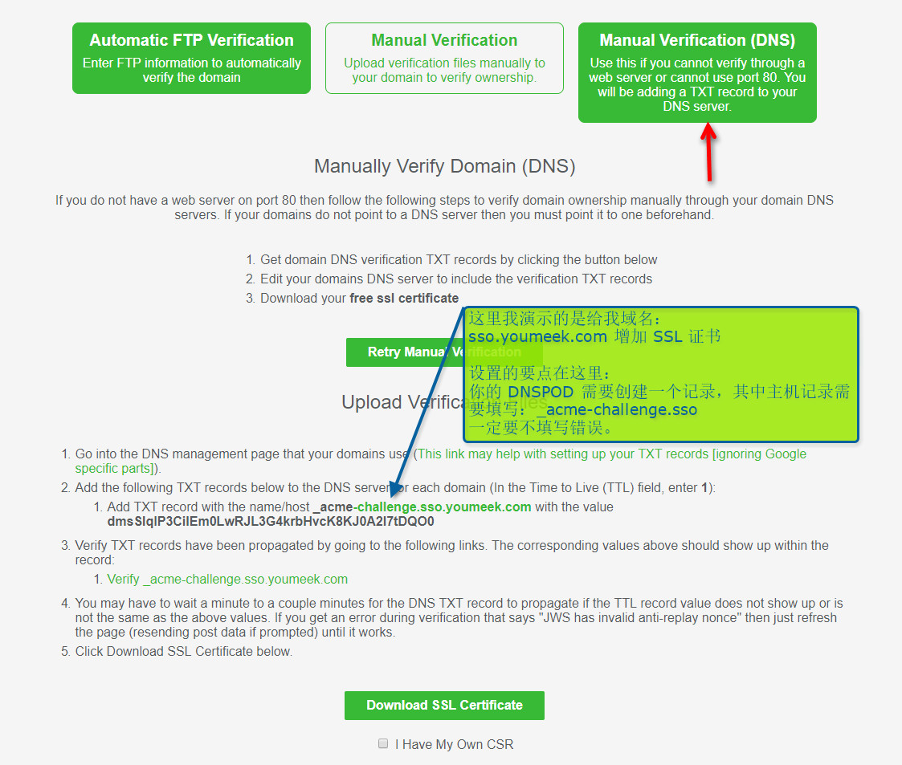

# Nginx 安装和配置


## Nginx 说明

- Nginx 是一个很强大的高性能 Web 和反向代理服务器，常被我们用作负载均衡服务器，也可以作为邮件代理服务器
- Nginx WIKI：<https://zh.wikipedia.org/zh/Nginx>
- Nginx 百科：<http://baike.baidu.com/item/nginx>
- Nginx 官网：<http://nginx.org/en/>
- Nginx 官网下载：<http://nginx.org/en/download.html>
    - 源码包方式下载：<http://nginx.org/en/download.html>，注意该页面的：`Stable version`，这个表示稳定版本，2016-03-22 最新版本是：`nginx-1.8.1`，这是一个  **tar.gz** 的文件链接。
    - 构建包方式下载：<http://nginx.org/en/linux_packages.html#stable>
- Nginx 文档：
    - 优先：<https://www.nginx.com/resources/wiki/>
    - 次要：<http://nginx.org/en/docs/>
- Nginx 模块地址：<https://www.nginx.com/resources/wiki/modules/>


## 来自网络上的一个好介绍

- 来源：<https://help.aliyun.com/knowledge_detail/6703521.html?spm=5176.788314854.2.2.CdMGlB>

> - 传统上基于进程或线程模型架构的 Web 服务通过每进程或每线程处理并发连接请求，这势必会在网络和 I/O 操作时产生阻塞，其另一个必然结果则是对内存或 CPU 的利用率低下。生成一个新的进程/线程需要事先备好其运行时环境，这包括为其分配堆内存和栈内存，以及为其创建新的执行上下文等。这些操作都需要占用 CPU，而且过多的进程/线程还会带来线程抖动或频繁的上下文切换，系统性能也会由此进一步下降。
> - 在设计的最初阶段，Nginx 的主要着眼点就是其高性能以及对物理计算资源的高密度利用，因此其采用了不同的架构模型。受启发于多种操作系统设计中基于“事件”的高级处理机制，nginx采用了模块化、事件驱动、异步、单线程及非阻塞的架构，并大量采用了多路复用及事件通知机制。在 Nginx 中，连接请求由为数不多的几个仅包含一个线程的进程 Worker 以高效的回环(run-loop)机制进行处理，而每个 Worker 可以并行处理数千个的并发连接及请求。
> - 如果负载以 CPU 密集型应用为主，如 SSL 或压缩应用，则 Worker 数应与 CPU 数相同；如果负载以 IO 密集型为主，如响应大量内容给客户端，则 Worker 数应该为 CPU 个数的 1.5 或 2 倍。
> - Nginx会按需同时运行多个进程：一个主进程(Master)和几个工作进程(Worker)，配置了缓存时还会有缓存加载器进程(Cache Loader)和缓存管理器进程(Cache Manager)等。所有进程均是仅含有一个线程，并主要通过“共享内存”的机制实现进程间通信。主进程以root用户身份运行，而 Worker、Cache Loader 和 Cache manager 均应以非特权用户身份运行。
> - 主进程主要完成如下工作：
    - 1.读取并验正配置信息；
    - 2.创建、绑定及关闭套接字；
    - 3.启动、终止及维护worker进程的个数；
    - 4.无须中止服务而重新配置工作特性；
    - 5.控制非中断式程序升级，启用新的二进制程序并在需要时回滚至老版本；
    - 6.重新打开日志文件，实现日志滚动；
    - 7.编译嵌入式perl脚本；
> - Worker 进程主要完成的任务包括：
    - 1.接收、传入并处理来自客户端的连接；
    - 2.提供反向代理及过滤功能；
    - 3.nginx任何能完成的其它任务；
> - Cache Loader 进程主要完成的任务包括：
    - 1.检查缓存存储中的缓存对象；
    - 2.使用缓存元数据建立内存数据库；
> - Cache Manager 进程的主要任务：
    - 1.缓存的失效及过期检验；

## Nginx 的 Docker 部署

- 预设好目录，在宿主机上创建下面目录：`mkdir -p /data/docker/nginx/html /data/docker/nginx/conf.d /data/docker/nginx/logs /data/docker/nginx/conf`
- **重点**：先准备好你的 nginx.conf 文件，存放在宿主机的：/data/docker/nginx/conf 目录下，等下需要映射。

```
worker_processes      1;

events {
  worker_connections  1024;
}

http {
  include             mime.types;
  default_type        application/octet-stream;

  sendfile on;

  keepalive_timeout   65;

  server {
    listen            80;
    server_name       localhost 127.0.0.1 193.112.221.203 youmeek.com;

    location / {
      root            /usr/share/nginx/html;
      index           index.html index.htm;
    }
  }
}
```

- 下载镜像：`docker pull nginx:1.12.2`
- 运行容器：`docker run --name youmeek-nginx -p 80:80 -v /data/docker/nginx/html:/usr/share/nginx/html:ro -v /data/docker/nginx/conf.d:/etc/nginx/conf.d -v /data/docker/nginx/logs:/var/log/nginx -v /data/docker/nginx/conf/nginx.conf:/etc/nginx/nginx.conf:ro -d nginx:1.12.2`
- 重新加载配置（目前测试无效，只能重启服务）：`docker exec -it youmeek-nginx nginx -s reload`
- 停止服务：`docker exec -it youmeek-nginx nginx -s stop` 或者：`docker stop youmeek-nginx`
- 重新启动服务：`docker restart youmeek-nginx`


## Nginx 源码编译安装

- 官网下载最新稳定版本 **1.8.1**，大小：814K
- 官网安装说明：<https://www.nginx.com/resources/wiki/start/topics/tutorials/install/>
- 源码编译配置参数说明：
    - <https://www.nginx.com/resources/wiki/start/topics/tutorials/installoptions/>
    - <http://nginx.org/en/docs/configure.html>
- 开始安装：
    - 安装依赖包：`yum install -y gcc gcc-c++ pcre pcre-devel zlib zlib-devel openssl openssl-devel`
    - 预设几个文件夹，方便等下安装的时候有些文件可以进行存放：
        - `mkdir -p /usr/local/nginx /var/log/nginx /var/temp/nginx /var/lock/nginx`
    - 下载源码包：`wget http://nginx.org/download/nginx-1.8.1.tar.gz`
    - 解压：`tar zxvf nginx-1.8.1.tar.gz`
    - 进入解压后目录：`cd nginx-1.8.1/`
    - 编译配置：

``` ini
./configure \
--prefix=/usr/local/nginx \
--pid-path=/var/local/nginx/nginx.pid \
--lock-path=/var/lock/nginx/nginx.lock \
--error-log-path=/var/log/nginx/error.log \
--http-log-path=/var/log/nginx/access.log \
--with-http_gzip_static_module \
--http-client-body-temp-path=/var/temp/nginx/client \
--http-proxy-temp-path=/var/temp/nginx/proxy \
--http-fastcgi-temp-path=/var/temp/nginx/fastcgi \
--http-uwsgi-temp-path=/var/temp/nginx/uwsgi \
--with-http_ssl_module \
--http-scgi-temp-path=/var/temp/nginx/scgi
```

    - 编译：`make`
    - 安装：`make install`
- 启动 Nginx
    - 先检查是否在 /usr/local 目录下生成了 Nginx 等相关文件：`cd /usr/local/nginx;ll`，正常的效果应该是显示这样的：
    
    ``` nginx
    drwxr-xr-x. 2 root root 4096 3月  22 16:21 conf
    drwxr-xr-x. 2 root root 4096 3月  22 16:21 html
    drwxr-xr-x. 2 root root 4096 3月  22 16:21 sbin
    ```

    - 停止防火墙：`service iptables stop`
        - 或是把 80 端口加入到的排除列表：
        - `sudo iptables -A INPUT -p tcp -m tcp --dport 80 -j ACCEPT`
        - `sudo service iptables save`
        - `sudo service iptables restart`
    - 启动：`/usr/local/nginx/sbin/nginx`，启动完成 shell 是不会有输出的
    - 检查 时候有 Nginx 进程：`ps aux | grep nginx`，正常是显示 3 个结果出来 
    - 检查 Nginx 是否启动并监听了 80 端口：`netstat -ntulp | grep 80` 
    - 访问：`192.168.1.114`，如果能看到：`Welcome to nginx!`，即可表示安装成功
    - 检查 Nginx 启用的配置文件是哪个：`/usr/local/nginx/sbin/nginx -t`
    - 刷新 Nginx 配置后重启：`/usr/local/nginx/sbin/nginx -s reload`
    - 停止 Nginx：`/usr/local/nginx/sbin/nginx -s stop`
    - 如果访问不了，或是出现其他信息看下错误立即：`vim /var/log/nginx/error.log`


## 把 Nginx 添加到系统服务中

- 新建文件：`vim /etc/init.d/nginx`
- 添加如下内容：

``` nginx
#!/bin/bash


#nginx执行程序路径需要修改
nginxd=/usr/local/nginx/sbin/nginx

# nginx配置文件路径需要修改
nginx_config=/usr/local/nginx/conf/nginx.conf

# pid 地址需要修改
nginx_pid=/var/local/nginx/nginx.pid


RETVAL=0
prog="nginx"

# Source function library.
. /etc/rc.d/init.d/functions
# Source networking configuration.
. /etc/sysconfig/network
# Check that networking is up.
[ ${NETWORKING} = "no" ] && exit 0
[ -x $nginxd ] || exit 0

# Start nginx daemons functions.
start() {
if [ -e $nginx_pid ];then
   echo "nginx already running...."
   exit 1
fi

echo -n $"Starting $prog: "
daemon $nginxd -c ${nginx_config}
RETVAL=$?
echo
[ $RETVAL = 0 ] && touch /var/lock/subsys/nginx
return $RETVAL
}

# Stop nginx daemons functions.
# pid 地址需要修改
stop() {
	echo -n $"Stopping $prog: "
	killproc $nginxd
	RETVAL=$?
	echo
	[ $RETVAL = 0 ] && rm -f /var/lock/subsys/nginx /var/local/nginx/nginx.pid
}

# reload nginx service functions.
reload() {
	echo -n $"Reloading $prog: "
	#kill -HUP `cat ${nginx_pid}`
	killproc $nginxd -HUP
	RETVAL=$?
	echo
}

# See how we were called.
case "$1" in
	start)
		start
		;;
	stop)
		stop
		;;
	reload)
		reload
		;;
	restart)
		stop
		start
		;;
	status)
		status $prog
		RETVAL=$?
		;;
	*)

	echo $"Usage: $prog {start|stop|restart|reload|status|help}"
	exit 1

esac
exit $RETVAL
```

- 修改权限：`chmod 755 /etc/init.d/nginx`
- 启动服务：`service nginx start`
- 停止服务：`service nginx stop`
- 重启服务：`service nginx restart`


## Nginx 无缝升级

- 使用新的参数`configure`后执行`make`重新编译,注意之后不要执行`make install`.新构建的Nginx会在`objs`目录下
- 备份旧的Nginx `cp 老的nginx目录/sbin/nginx 老的nginx目录/sbin/nginx.old`
- 复制新的Nginx `cp ./objs/nginx 老的nginx目录/sbin/`,可能提示Nginx被占用,如果是则强制覆盖即可.
- 检查下Makefile的更新指令 `cat Makefile`,检查下路径是否匹配,一般没什么问题毕竟是根据你的参数生成的文件.
```bash
upgrade:
	/usr/local/nginx/sbin/nginx -t

	kill -USR2 `cat /var/local/nginx/nginx.pid`
	sleep 1
	test -f /var/local/nginx/nginx.pid.oldbin

	kill -QUIT `cat /var/local/nginx/nginx.pid.oldbin`
```
- 更新 `make upgrade`


## Nginx 全局变量

- $arg_PARAMETER #这个变量包含GET请求中，如果有变量PARAMETER时的值。
- $args #这个变量等于请求行中(GET请求)的参数，例如foo=123&bar=blahblah;
- $binary_remote_addr #二进制的客户地址。
- $body_bytes_sent #响应时送出的body字节数数量。即使连接中断，这个数据也是精确的。
- $content_length #请求头中的Content-length字段。
- $content_type #请求头中的Content-Type字段。
- $cookie_COOKIE #cookie COOKIE变量的值
- $document_root #当前请求在root指令中指定的值。
- $document_uri #与$uri相同。
- $host #请求主机头字段，否则为服务器名称。
- $hostname #Set to the machine’s hostname as returned by gethostname
- $http_HEADER
- $is_args #如果有$args参数，这个变量等于”?”，否则等于”"，空值。
- $http_user_agent #客户端agent信息
- $http_cookie #客户端cookie信息
- $limit_rate #这个变量可以限制连接速率。
- $query_string #与$args相同。
- $request_body_file #客户端请求主体信息的临时文件名。
- $request_method #客户端请求的动作，通常为GET或POST。
- $remote_addr #客户端的IP地址。
- $remote_port #客户端的端口。
- $remote_user #已经经过Auth Basic Module验证的用户名。
- $request_completion #如果请求结束，设置为OK. 当请求未结束或如果该请求不是请求链串的最后一个时，为空(Empty)。
- $request_method #GET或POST
- $request_filename #当前请求的文件路径，由root或alias指令与URI请求生成。
- $request_uri #包含请求参数的原始URI，不包含主机名，如：”/foo/bar.php?arg=baz”。不能修改。
- $scheme #HTTP方法（如http，https）。
- $server_protocol #请求使用的协议，通常是HTTP/1.0或HTTP/1.1。
- $server_addr #服务器地址，在完成一次系统调用后可以确定这个值。
- $server_name #服务器名称。
- $server_port #请求到达服务器的端口号。
- $uri #不带请求参数的当前URI，$uri不包含主机名，如”/foo/bar.html”。该值有可能和$request_uri 不一致。
- $request_uri是浏览器发过来的值。该值是rewrite后的值。例如做了internal redirects后。

## Nginx 配置

- Nginx 默认配置文件：`vim /usr/local/nginx/conf/nginx.conf`

### Nginx 在 1.8.1 版本下的默认配置（去掉注释）

``` nginx
user root;#我这里习惯使用 root，所以这里需要这样设置。如果你有为你的 nginx 专门配置一个用户，这里需要改为你的用户
worker_processes  1;

events {
    worker_connections  1024;
}

http {
    include       mime.types;
    default_type  application/octet-stream;

    sendfile        on;
    keepalive_timeout  65;

    server {
        listen       80;
        server_name  localhost;

        location / {
            root   html;
            index  index.html index.htm;
        }

        error_page   500 502 503 504  /50x.html;
        location = /50x.html {
            root   html;
        }
    }
}
```

### HTTP 服务，虚拟主机

- 停止防火墙：`service iptables stop`，防止出现特别干扰
- 编辑默认的配置文件：`vim /usr/local/nginx/conf/nginx.conf`
- 设置两个虚拟主机（通过**端口**来区分开）

``` nginx
user root;#我这里习惯使用 root，所以这里需要这样设置。如果你有为你的 nginx 专门配置一个用户，这里需要改为你的用户
worker_processes  1;

events {
    worker_connections  1024;
}

http {
    include       mime.types;
    default_type  application/octet-stream;

    sendfile        on;
    keepalive_timeout  65;

    # 一个 server 代表一个虚拟主机
    server {
        listen       80;
        server_name  localhost;

        location / {
            # 虚拟机根目录是 /usr/local/nginx/html 目录
            root   html;
            # 虚拟机首页是 /usr/local/nginx/html 目录下这两个文件
            index  index.html index.htm;
        }

        error_page   500 502 503 504  /50x.html;
        location = /50x.html {
            root   html;
        }
    }
    
    server {
        # 第二个虚拟机的端口是 90，服务地址还是本地
        listen       90;
        server_name  localhost;

        location / {
            root   html90;
            index  index.html index.htm;
        }

        error_page   500 502 503 504  /50x.html;
        location = /50x.html {
            root   html;
        }
    }
}
```

- 设置两个虚拟主机（通过**域名**来区分开）

``` nginx
user root;#我这里习惯使用 root，所以这里需要这样设置。如果你有为你的 nginx 专门配置一个用户，这里需要改为你的用户
worker_processes  1;

events {
    worker_connections  1024;
}

http {
    include       mime.types;
    default_type  application/octet-stream;

    sendfile        on;
    keepalive_timeout  65;

    # 一个 server 代表一个虚拟主机
    server {
        listen       80;
        # 两个虚拟主机都使用 80 端口，设置不同域名
        server_name  code.youmeek.com;

        location / {
            # 虚拟机根目录是 /usr/local/nginx/html 目录
            root   html;
            # 虚拟机首页是 /usr/local/nginx/html 目录下这两个文件
            index  index.html index.htm;
        }

        error_page   500 502 503 504  /50x.html;
        location = /50x.html {
            root   html;
        }
    }
    
    server {
        listen       80;
        # 两个虚拟主机都使用 80 端口，设置不同域名
        server_name  i.youmeek.com;

        location / {
            root   html-i;
            index  index.html index.htm;
        }

        error_page   500 502 503 504  /50x.html;
        location = /50x.html {
            root   html;
        }
    }
}
```


### 反向代理和负载均衡

- 最精简的环境：一台虚拟机
    - 1 个 JDK
    - 1 个 Nginx
    - 2 个 Tomcat
    
- Nginx 配置：

``` nginx
user root;#我这里习惯使用 root，所以这里需要这样设置。如果你有为你的 nginx 专门配置一个用户，这里需要改为你的用户
worker_processes  1;

events {
    worker_connections  1024;
}

http {
    include       mime.types;
    default_type  application/octet-stream;

    sendfile        on;
    keepalive_timeout  65;

    # 自己定义的两个 tomcat 请求地址和端口
    # 也就是当浏览器请求：tomcat.youmeek.com 的时候从下面这两个 tomcat 中去找一个进行转发
    upstream tomcatCluster {
        server 192.168.1.114:8080;
        server 192.168.1.114:8081;
        
        # 添加 weight 字段可以表示权重，值越高权重越大，默认值是 1，最大值官网没说，一般如果设置也就设置 3,5,7 这样的数
        # 官网：https://www.nginx.com/resources/admin-guide/load-balancer/#weight
        # server 192.168.1.114:8080 weight=2;
        # server 192.168.1.114:8081 weight=1;
    }

    server {
        listen       80;
        server_name  tomcat.youmeek.com;

        location / {
            proxy_pass   http://tomcatCluster;
            index  index.html index.htm;
        }
    }
}
```

### 配置 HTTPS 服务（SSL 证书配置）

- 免费申请 SSL 证书渠道
	- 教程：<https://www.wn789.com/4394.html> 
	- SSL For Free：<https://www.sslforfree.com>
	- 配置要点其实就是下面该图：
- 
- 一般你会下载下面两个文件：`certificate.crt`，`private.key`
- 如果你需要把 crt 和 key 的证书转换成 keystore（如果你有这个需求的话）
- 从 key 和 crt 生成 pkcs12 格式的 keystore，生成过程会让人你输入密码，这个密码下面会用到，我这里假设输入 123456
	- `openssl pkcs12 -export -in certificate.crt -inkey private.key -out youmeek.p12 -name youmeek -CAfile certificate.crt -caname -chain`
	- `keytool -importkeystore -v -srckeystore youmeek.p12 -srcstoretype pkcs12 -srcstorepass 123456 -destkeystore youmeek.keystore -deststoretype jks -deststorepass 123456`  
- 修改 nginx 配置文件，增加对 HTTPS 支持（下面的配置是基于默认安装 nginx 后的配置）
- `vim /usr/local/nginx/conf/nginx.conf`


```
worker_processes  1;
events {
    worker_connections  1024;
}
http {
    include       mime.types;
    default_type  application/octet-stream;
    sendfile        on;
    keepalive_timeout  65;
    
    # 如果访问 http 也直接跳转到 https
    server {
        listen       80;
        server_name sso.youmeek.com;
        return 301 https://$server_name$request_uri;
    }
    
    # crt 和 key 文件的存放位置根据你自己存放位置进行修改
    server {
        listen       443;
        server_name  sso.youmeek.com;
        ssl  on;
        ssl_certificate     /opt/ssl/certificate.crt;
        ssl_certificate_key /opt/ssl/private.key;
        location / {
            root   html;
            index  index.html index.htm;
        }
        error_page   500 502 503 504  /50x.html;
        location = /50x.html {
            root   html;
        }
    }
}

```


## Nginx 监控模块

- 如果你需要监控 nginx 情况可以安装的加入这个模块 http_stub_status_module：

``` ini
./configure \
--prefix=/usr/local/nginx \
--pid-path=/var/local/nginx/nginx.pid \
--lock-path=/var/lock/nginx/nginx.lock \
--error-log-path=/var/log/nginx/error.log \
--http-log-path=/var/log/nginx/access.log \
--with-http_gzip_static_module \
--http-client-body-temp-path=/var/temp/nginx/client \
--http-proxy-temp-path=/var/temp/nginx/proxy \
--http-fastcgi-temp-path=/var/temp/nginx/fastcgi \
--http-uwsgi-temp-path=/var/temp/nginx/uwsgi \
--with-http_ssl_module \
--http-scgi-temp-path=/var/temp/nginx/scgi \
--with-http_stub_status_module
```

- 然后在 nginx.conf 文件的 location 区域增加：stub_status on;


```ini
location /nginx_status {
    #allow 192.168.1.100;
    #deny all;
    stub_status on;
    access_log   off;
}
```

- 当你访问：http://127.0.0.1/nginx_status，会得到类似下面的结果
- 其中配置的 `allow 192.168.1.100;` 表示只允许客户端 IP 为这个才能访问这个地址
- `deny all;` 除了被允许的，其他所有人都不可以访问

```
Active connections: 1
server accepts handled requests
 3 6 9   
Reading: 0 Writing: 5 Waiting: 0   
```

- Active connections: 对后端发起的活动连接数（最常需要看的就是这个参数）
- Server accepts handled requests: Nginx总共处理了 3 个连接,成功创建 6 次握手(证明中间没有失败的),总共处理了 9 个请求.
- Reading: Nginx 读取到客户端的 Header 信息数.
- Writing: Nginx 返回给客户端的 Header 信息数.
- Waiting: 开启keep-alive的情况下,这个值等于 active – (reading + writing),意思就是 Nginx 已经处理完成,正在等候下一次请求指令的驻留连接.
- 所以,在访问效率高,请求很快被处理完毕的情况下,Waiting数比较多是正常的.如果reading +writing数较多,则说明并发访问量非常大,正在处理过程中.

## Nginx 配置文件常用配置积累

### location 配置


``` nginx
= 开头表示精确匹配
^~ 开头表示uri以某个常规字符串开头，不是正则匹配
~ 开头表示区分大小写的正则匹配;
~* 开头表示不区分大小写的正则匹配
/ 通用匹配, 如果没有其它匹配,任何请求都会匹配到

location / {

}

location /user {

}

location = /user {

}

location /user/ {

}

location ^~ /user/ {

}

location /user/youmeek {

}

location ~ /user/youmeek {

}

location ~ ^(/cas/|/casclient1/|/casclient2/|/casclient3/) {

}

location ~ .*\.(gif|jpg|jpeg|png|bmp|swf|ico|woff|woff2|ttf|eot|txt)$ {

}

location ~ .*$ {

}
```


### HTTP 服务，绑定多个域名

- <https://www.ttlsa.com/nginx/use-nginx-proxy/>


### 安装第三方模块

### 生成规格图

### 启用 Gzip 压缩


### 防盗链

- <https://help.aliyun.com/knowledge_detail/5974693.html?spm=5176.788314853.2.18.s4z1ra>


### Nginx 禁止特定用户代理（User Agents）访问，静止指定 IP 访问

- <https://www.ttlsa.com/nginx/how-to-block-user-agents-using-nginx/>
- <https://help.aliyun.com/knowledge_detail/5974693.html?spm=5176.788314853.2.18.s4z1ra>
- <>
- <>
- <>

### Nginx 缓存


### Nginx 自动分割日志文件


### Nginx 处理跨域请求


### 安全相预防


在配置文件中设置自定义缓存以限制缓冲区溢出攻击的可能性
client_body_buffer_size 1K;
client_header_buffer_size 1k;
client_max_body_size 1k;
large_client_header_buffers 2 1k;

7. 将timeout设低来防止DOS攻击
所有这些声明都可以放到主配置文件中。
client_body_timeout 10;
client_header_timeout 10;
keepalive_timeout 5 5;
send_timeout 10;


8. 限制用户连接数来预防DOS攻击
limit_zone slimits $binary_remote_addr 5m;
limit_conn slimits 5;


## 使用 logrotate 做 nginx 日志轮询分割

- 前提：
	- 我 nginx 的成功日志路径：/var/log/nginx/access.log
	- 我 nginx 的错误日志路径：/var/log/nginx/error.log
	- pid 路径：/var/local/nginx/nginx.pid

- 一般情况 CentOS 是装有：logrotate，你可以检查下：`rpm -ql logrotate`，如果有相应结果，则表示你也装了。
- logrotate 配置文件一般在：
	- 全局配置：/etc/logrotate.conf 通用配置文件，可以定义全局默认使用的选项。
	- 自定义配置，放在这个目录下的都算是：/etc/logrotate.d/

- 针对 nginx 创建自定义的配置文件：`vim /etc/logrotate.d/nginx`
- 文件内容如下：

``` ini

/var/log/nginx/access.log /var/log/nginx/error.log {
	create 644 root root
	notifempty
	daily
	rotate 15
	missingok
	dateext
	sharedscripts
	postrotate
	    if [ -f /var/local/nginx/nginx.pid ]; then
	        kill -USR1 `cat /var/local/nginx/nginx.pid`
	    fi
	endscript
}

```

- /var/log/nginx/access.log /var/log/nginx/error.log：多个文件用空格隔开，也可以用匹配符：/var/log/nginx/*.log
- notifempty：如果是空文件的话，不转储
- create 644 root root：create mode owner group 转储文件，使用指定的文件模式创建新的日志文件
- 调用频率，有：daily，weekly，monthly可选
- rotate 15：一次将存储15个归档日志。对于第16个归档，时间最久的归档将被删除。
- sharedscripts：所有的日志文件都轮转完毕后统一执行一次脚本
- missingok：如果日志文件丢失，不报错继续执行下一个
- dateext：文件后缀是日期格式,也就是切割后文件是:xxx.log-20131216.gz 这样,如果注释掉,切割出来是按数字递增,即前面说的 xxx.log-1 这种格式
- postrotate：执行命令的开始标志
- endscripthttp:执行命令的结束标志
- if 判断的意思不是中止Nginx的进程，而是传递给它信号重新生成日志，如果nginx没启动不做操作    
- 更多参数可以看：<http://www.cnblogs.com/zengkefu/p/5498324.html>


- 手动执行测试：`/usr/sbin/logrotate -vf /etc/logrotate.d/nginx`
- 参数：‘-f’选项来强制logrotate轮循日志文件，‘-v’参数提供了详细的输出。
- 验证是否手动执行成功，查看 cron 的日志即可：`grep logrotate /var/log/cron`
- 设置 crontab 定时任务：`vim /etc/crontab`，添加下面内容：

``` ini
//每天02点10分执行一次
10 02 * * *  /usr/sbin/logrotate -f /etc/logrotate.d/nginx
```


### 杂七杂八

- [nginx实现简体繁体字互转以及中文转拼音](https://www.ttlsa.com/nginx/nginx-modules-ngx_set_cconv/)
- [nginx记录分析网站响应慢的请求(ngx_http_log_request_speed)](https://www.ttlsa.com/nginx/nginx-modules-ngx_http_log_request_speed/)
- [nginx空白图片(empty_gif模块)](https://www.ttlsa.com/nginx/nginx-modules-empty_gif/)


## 资料

- <https://help.aliyun.com/knowledge_detail/5974693.html?spm=5176.788314853.2.18.s4z1ra>
- <http://www.ydcss.com/archives/466>
- <http://blog.sae.sina.com.cn/archives/2107>
- <http://www.nginx.cn/273.html>
- <http://printfabcd.iteye.com/blog/1200382>