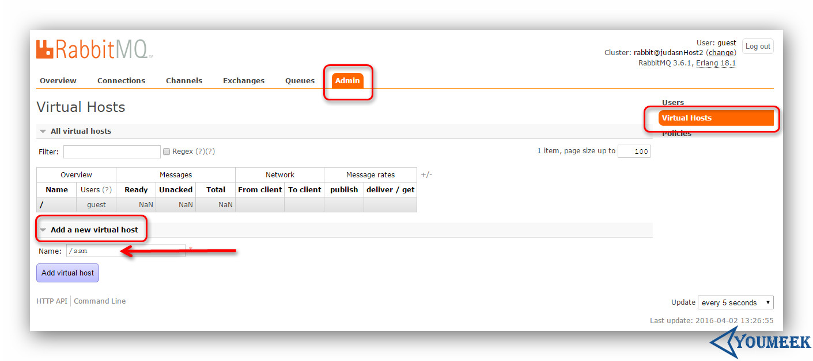
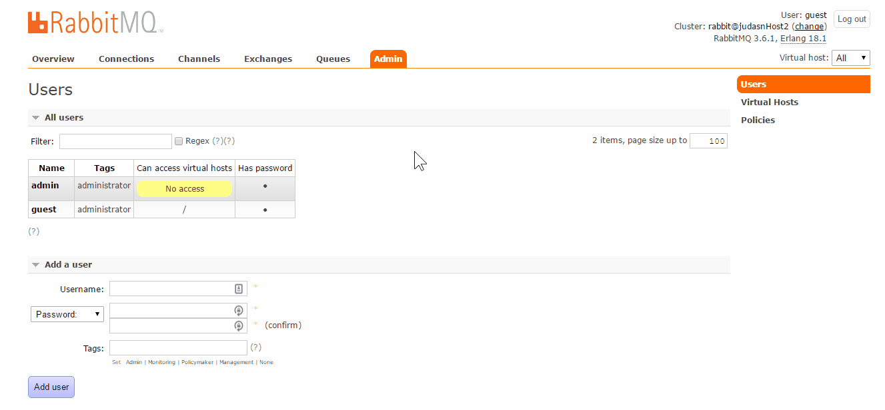
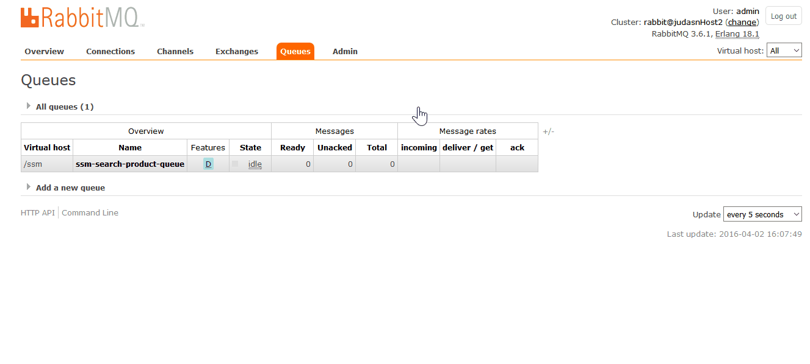

# RabbitMQ 安装和配置


## Docker 安装 RabbitMQ

- 官网镜像：<https://hub.docker.com/_/rabbitmq/>
- 官网镜像说明：<https://docs.docker.com/samples/library/rabbitmq>
- 一般情况，运行：

```
docker run -d --name cloud-rabbitmq -p 5671:5671 -p 5672:5672 -p 4369:4369 -p 25672:25672 -p 15671:15671 -p 15672:15672 -e RABBITMQ_DEFAULT_USER=admin -e RABBITMQ_DEFAULT_PASS=adg123456 rabbitmq:3-management
```

- 带有 websocket stomp 功能（不知道是什么就不用管它）：

``` 
docker run -d --name cloud-rabbitmq -p 5671:5671 -p 5672:5672 -p 4369:4369 -p 25672:25672 -p 15671:15671 -p 15672:15672 -p 61613:61613 -e RABBITMQ_DEFAULT_USER=admin -e RABBITMQ_DEFAULT_PASS=adg123456 rabbitmq:3-management


进入 Docker 容器启动 stomp 插件：
docker exec -it cloud-rabbitmq /bin/bash
cd /plugins
rabbitmq-plugins enable rabbitmq_web_stomp
```


- 参数解释：
- rabbitmq:3-management：只有带 management 后缀的才有 web 端管理入口
- 15672：表示 RabbitMQ 控制台端口号，可以在浏览器中通过控制台来执行 RabbitMQ 的相关操作。容器启动成功后，可以在浏览器输入地址：http://ip:15672/ 访问控制台
- 5672: 表示 RabbitMQ 所监听的 TCP 端口号，应用程序可通过该端口与 RabbitMQ 建立 TCP 连接，完成后续的异步消息通信
- RABBITMQ_DEFAULT_USER：用于设置登陆控制台的用户名，这里我设置 admin
- RABBITMQ_DEFAULT_PASS：用于设置登陆控制台的密码，这里我设置 admin

## RabbitMQ 说明

- MQ 全称为 Message Queue, 消息队列（MQ）是一种应用程序对应用程序的通信方法。应用程序通过读写出入队列的消息（针对应用程序的数据）来通信，而无需专用连接来链接它们。
    - RabbitMQ 是一个在 AMQP 基础上完整的，可复用的企业消息系统。他遵循 Mozilla Public License 开源协议。
- RabbitMQ WIKI：<https://zh.wikipedia.org/zh/RabbitMQ>
- RabbitMQ 百科：<http://baike.baidu.com/view/4095865.htm>
- RabbitMQ 官网：<http://www.rabbitmq.com/>
- RabbitMQ 官网下载：<http://www.rabbitmq.com/download.html>
- RabbitMQ 官网安装文档：<http://www.rabbitmq.com/install-rpm.html>
- RabbitMQ 文档：
    - 优先：<http://www.rabbitmq.com/getstarted.html>
    - 次要：<http://www.rabbitmq.com/documentation.html>
 
## 基于 epel 源进行安装（优先）

- 来源：<http://blog.csdn.net/wh211212/article/details/53893085>

```
rpm -Uvh http://download.fedoraproject.org/pub/epel/6/i386/epel-release-6-8.noarch.rpm

# 安装依赖环境erlang
yum install erlang -y

# 安装rabbitmq
yum install rabbitmq-server -y
```

## 本地安装

#### 本地安装 Erlang

- 有 EPEL 源的情况（需要安装的内容较多，宽带要能跟上）：`sudo yum install erlang`
- RabbitMQ 官网提供 Erlang 安装包：
    - 下载地址：<http://www.rabbitmq.com/releases/erlang/>
    - 下载好之后，安装下面两个文件：
        - `sudo yum localinstall -y esl-erlang_18.1-1~centos~6_amd64.rpm`
        - `sudo yum localinstall -y esl-erlang-compat-18.1-1.noarch.rpm`


#### rpm 安装 RabbitMQ

- 此时（2016-04），最新版：**3.6.1**
- 安装：`rpm --import https://www.rabbitmq.com/rabbitmq-signing-key-public.asc`
- 安装：`sudo yum install -y rabbitmq-server-3.6.1-1.noarch.rpm`
- 启动服务：
    - 先看下自己的主机名：`hostname`，我的主机名是：**judasnHost2**
    - 先修改一下 host 文件：`vim /etc/hosts`，添加一行：`127.0.0.1 judasnHost2`（必须这样做）
    - 启动：`service rabbitmq-server start`，启动一般都比较慢，所以别急
    - 停止：`service rabbitmq-server stop`
    - 重启：`service rabbitmq-server restart`
	- 设置开机启动：`chkconfig rabbitmq-server on`


## 配置

- 查找默认配置位置：`find / -name "rabbitmq.config.example"`，我这边搜索结果是：`/usr/share/doc/rabbitmq-server-3.6.1/rabbitmq.config.example`
- 复制默认配置：`cp /usr/share/doc/rabbitmq-server-3.6.1/rabbitmq.config.example /etc/rabbitmq/`
- 修改配置文件名：`cd /etc/rabbitmq ; mv rabbitmq.config.example rabbitmq.config`
- 编辑配置文件，开启用户远程访问：`vim rabbitmq.config`
	- 在 64 行，默认有这样一句话：`%% {loopback_users, []},`，注意，该语句最后有一个逗号，等下是要去掉的
	- 我们需要改为：`{loopback_users, []}`，
- 开启 Web 界面管理：`rabbitmq-plugins enable rabbitmq_management`
	- 如果你是用 epel 安装的话，则是这样运行：`cd /usr/lib/rabbitmq/bin;./rabbitmq-plugins enable rabbitmq_management`
- 重启 RabbitMQ 服务：`service rabbitmq-server restart`
- 开放防火墙端口：
	- `sudo iptables -I INPUT -p tcp -m tcp --dport 15672 -j ACCEPT`
	- `sudo iptables -I INPUT -p tcp -m tcp --dport 5672 -j ACCEPT`
	- `sudo service iptables save`
	- `sudo service iptables restart`
- 浏览器访问：`http://192.168.1.114:15672`
	默认管理员账号：**guest**
	默认管理员密码：**guest**
- 添加新授权用户（如下图所示）：
    - 
- 添加 Host（如下图所示）：
    - 
- 给添加的 Host 设置权限（如下图所示）：
    - 
- 交换机绑定队列（如下图所示）：
    - 

## 集群环境（镜像队列）

- TODO

## 消息重复

- 消息重复无法避免，比如消费端异常重启就有可能，或者 MQ 应用挂了重启之后等场景，任何 MQ 应用没有保证消息不会重复发送。
- 对于一定要保证幂等性的业务场景，在消费端做好标识。比如在 Redis 或 JVM 缓存中存有上一次消费的记录，业务操作之前下判断。
- 如果是插入操作类的，也可以考虑用唯一约束的方式来保证插入不会重复等。

## 消息丢失

- 单节点，纯内存情况下一般有三种情况：
	- 生产者提交消息到 MQ，但是网络抖动了，丢了。或是 MQ 拿到之后突然挂了，来不及登记
	- MQ 拿到消息，消费者还没消费，但是 MQ 挂了
	- 消费者拿到消息来不及处理，自己挂了，MQ 认为已经消费成功了。
- 分别解决办法：
	- 把 channel 设置为 confirm 模式
	- 持久化队列：创建 queue 的时候持久化 durable=true。持久化消息：生产者发送消息时候：deliveryMode = 2 
	- 手动 ACK

## 消息顺序

- 一般场景不需要消息顺序，要去做一般也开销很大，需要执行考虑。
- 在能保证消息顺序的情况下，可以用来做数据同步
- 解决：
	- 消费者只有单个应用，并且内容不要使用异步或者多线程。在这种场景下绑定 queue，**基于消息队列本质是队列，消息是 FIFO（先进先出）的**，这样消息就能按顺序。但是缺点很明显：吞吐太差，效率太低，适合低效率的业务。
	- 基于上面方案并且对队列进行分片。假设我们原来 repay.queue下面有 10 个消费者线程，那么我们可以创建10个队列，每个队列下面只允许有一个消费者。一个比较简单的方式是，队列命名为 repay.queue-0，repay.queue-2…repay.queue-9，然后生产者推送信息的时候，基于用户的ID（Long类型）mod 10 取模 0…9（取余），再选择发送到相应的队列即可，这样就等保证同一个用户的顺序。

## 消息积压

- 如果消费者挂掉，消息会一直积压在 MQ 中
- 解决办法
	- 如果原来有 3 个消费者应用，现在需要准备多倍的消费者应用，假设现在有 10 个新的消费者应用。
	- 创建一个临时的 topic，假设叫做 topic_abc
	- 新的 10 个消费者应用绑定在新的 topic_abc 上
	- 修改原来 3 个消费者应用代码，改为接受到 MQ 消息后不操作入数据库了，而是直接发给 topic_abc
	- 这样原来积压的消息就有 10 个消费者一起来分摊
	- 如果此时这个 MQ 扛不住压力，那只能让旧的 3 个消费者应用写到其他 MQ，然后 10 个新消费者消费新的 MQ。
	- 然后深夜找个时间重新欢迎旧的 3 个消费者代码。


## 资料

- <http://throwable.coding.me/2018/03/25/out-of-order-consume/>


