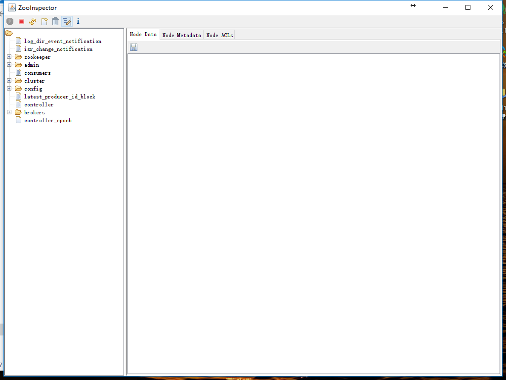
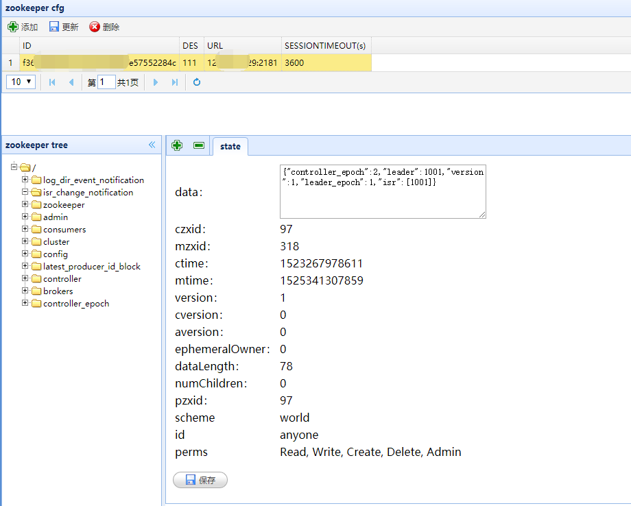

# Zookeeper 安装


## Docker 部署 Zookeeper


#### 单个实例

- 官网仓库：<https://hub.docker.com/r/library/zookeeper/>
- 单个实例：`docker run -d --restart always --name one-zookeeper -p 2181:2181 -v /etc/localtime:/etc/localtime zookeeper:latest`
	- 默认端口暴露是：`This image includes EXPOSE 2181 2888 3888 (the zookeeper client port, follower port, election port respectively)`
- 容器中的几个重要目录（有需要挂载的可以指定）：
	- `/data`
	- `/datalog`
	- `/conf`


#### 单机多个实例（集群）

- 创建 docker compose 文件：`vim zookeeper.yml`
- 下面内容来自官网仓库：<https://hub.docker.com/r/library/zookeeper/>

```
version: '3.1'

services:
  zoo1:
    image: zookeeper
    restart: always
    hostname: zoo1
    ports:
      - 2181:2181
    environment:
      ZOO_MY_ID: 1
      ZOO_SERVERS: server.1=0.0.0.0:2888:3888 server.2=zoo2:2888:3888 server.3=zoo3:2888:3888

  zoo2:
    image: zookeeper
    restart: always
    hostname: zoo2
    ports:
      - 2182:2181
    environment:
      ZOO_MY_ID: 2
      ZOO_SERVERS: server.1=zoo1:2888:3888 server.2=0.0.0.0:2888:3888 server.3=zoo3:2888:3888

  zoo3:
    image: zookeeper
    restart: always
    hostname: zoo3
    ports:
      - 2183:2181
    environment:
      ZOO_MY_ID: 3
      ZOO_SERVERS: server.1=zoo1:2888:3888 server.2=zoo2:2888:3888 server.3=0.0.0.0:2888:3888
```

- 启动：`docker-compose -f zookeeper.yml -p zk_test up -d`
	- 参数 -p zk_test 表示这个 compose project 的名字，等价于：`COMPOSE_PROJECT_NAME=zk_test docker-compose -f zookeeper.yml up -d`
	- 不指定项目名称，Docker-Compose 默认以当前文件目录名作为应用的项目名
	- 报错是正常情况的。
- 停止：`docker-compose -f zookeeper.yml -p zk_test stop`

#### 先安装 nc 再来校验 zookeeper 集群情况

- 环境：CentOS 7.4
- 官网下载：<https://nmap.org/download.html>，找到 rpm 包
- 当前时间（201803）最新版本下载：`wget https://nmap.org/dist/ncat-7.60-1.x86_64.rpm`
- 安装：`sudo rpm -i ncat-7.60-1.x86_64.rpm`
- ln 下：`sudo ln -s /usr/bin/ncat /usr/bin/nc`
- 检验：`nc --version`

#### 校验

- 命令：`echo stat | nc 127.0.0.1 2181`，得到如下信息：

```
Zookeeper version: 3.4.11-37e277162d567b55a07d1755f0b31c32e93c01a0, built on 11/01/2017 18:06 GMT
Clients:
 /172.21.0.1:58872[0](queued=0,recved=1,sent=0)

Latency min/avg/max: 0/0/0
Received: 1
Sent: 0
Connections: 1
Outstanding: 0
Zxid: 0x100000000
Mode: follower
Node count: 4
```

- 命令：`echo stat | nc 127.0.0.1 2182`，得到如下信息：

```
Zookeeper version: 3.4.11-37e277162d567b55a07d1755f0b31c32e93c01a0, built on 11/01/2017 18:06 GMT
Clients:
 /172.21.0.1:36190[0](queued=0,recved=1,sent=0)

Latency min/avg/max: 0/0/0
Received: 1
Sent: 0
Connections: 1
Outstanding: 0
Zxid: 0x500000000
Mode: follower
Node count: 4
```


- 命令：`echo stat | nc 127.0.0.1 2183`，得到如下信息：

```
Zookeeper version: 3.4.11-37e277162d567b55a07d1755f0b31c32e93c01a0, built on 11/01/2017 18:06 GMT
Clients:
 /172.21.0.1:33344[0](queued=0,recved=1,sent=0)

Latency min/avg/max: 0/0/0
Received: 1
Sent: 0
Connections: 1
Outstanding: 0
Zxid: 0x500000000
Mode: leader
Node count: 4
```

#### 多机多个实例（集群）

- 三台机子：
	- 内网 ip：`172.24.165.129`，外网 ip：`47.91.22.116`
	- 内网 ip：`172.24.165.130`，外网 ip：`47.91.22.124`
	- 内网 ip：`172.24.165.131`，外网 ip：`47.74.6.138`
- 修改三台机子 hostname：
	- 节点 1：`hostnamectl --static set-hostname youmeekhost1`
	- 节点 2：`hostnamectl --static set-hostname youmeekhost2`
	- 节点 3：`hostnamectl --static set-hostname youmeekhost3`
- 三台机子的 hosts 都修改为如下内容：`vim /etc/hosts`

```
172.24.165.129 youmeekhost1
172.24.165.130 youmeekhost2
172.24.165.131 youmeekhost3
```

- 节点 1：

```
docker run -d \
-v /data/docker/zookeeper/data:/data \
-v /data/docker/zookeeper/log:/datalog \
-e ZOO_MY_ID=1 \
-e "ZOO_SERVERS=server.1=youmeekhost1:2888:3888 server.2=youmeekhost2:2888:3888 server.3=youmeekhost3:2888:3888" \
--name=zookeeper1 --net=host --restart=always zookeeper
```


- 节点 2：

```
docker run -d \
-v /data/docker/zookeeper/data:/data \
-v /data/docker/zookeeper/log:/datalog \
-e ZOO_MY_ID=2 \
-e "ZOO_SERVERS=server.1=youmeekhost1:2888:3888 server.2=youmeekhost2:2888:3888 server.3=youmeekhost3:2888:3888" \
--name=zookeeper2 --net=host --restart=always zookeeper
```


- 节点 3：

```
docker run -d \
-v /data/docker/zookeeper/data:/data \
-v /data/docker/zookeeper/log:/datalog \
-e ZOO_MY_ID=3 \
-e "ZOO_SERVERS=server.1=youmeekhost1:2888:3888 server.2=youmeekhost2:2888:3888 server.3=youmeekhost3:2888:3888" \
--name=zookeeper3 --net=host --restart=always zookeeper
```


## 需要环境

- JDK 安装

## 下载安装

- 官网：<https://zookeeper.apache.org/>
- 此时（201702）最新稳定版本：Release `3.4.9`
- 官网下载：<http://www.apache.org/dyn/closer.cgi/zookeeper/>
- 我这里以：`zookeeper-3.4.8.tar.gz` 为例
- 安装过程：
	- `mkdir -p /usr/program/zookeeper/data`
	- `cd /opt/setups`
	- `tar zxvf zookeeper-3.4.8.tar.gz`
	- `mv /opt/setups/zookeeper-3.4.8 /usr/program/zookeeper`
	- `cd /usr/program/zookeeper/zookeeper-3.4.8/conf`
    - `mv zoo_sample.cfg zoo.cfg`
	- `vim zoo.cfg`
- 将配置文件中的这个值：
	- 原值：`dataDir=/tmp/zookeeper`
	- 改为：`dataDir=/usr/program/zookeeper/data`
- 防火墙开放2181端口
	- `iptables -A INPUT -p tcp -m tcp --dport 2181 -j ACCEPT`
	- `service iptables save`
	- `service iptables restart`
- 启动 zookeeper：`sh /usr/program/zookeeper/zookeeper-3.4.8/bin/zkServer.sh start`
- 停止 zookeeper：`sh /usr/program/zookeeper/zookeeper-3.4.8/bin/zkServer.sh stop`
- 查看 zookeeper 状态：`sh /usr/program/zookeeper/zookeeper-3.4.8/bin/zkServer.sh status`
	- 如果是集群环境，下面几种角色
		- leader
		- follower

## 集群环境搭建

### 确定机子环境

- 集群环境最少节点是：3，且节点数必须是奇数，生产环境推荐是：5 个机子节点。
- 系统都是 CentOS 6
- 机子 1：192.168.1.121
- 机子 2：192.168.1.111
- 机子 3：192.168.1.112

### 配置

- 在三台机子上都做如上文的流程安装，再补充修改配置文件：`vim /usr/program/zookeeper/zookeeper-3.4.8/conf/zoo.cfg`
- 三台机子都增加下面内容：

``` nginx
server.1=192.168.1.121:2888:3888
server.2=192.168.1.111:2888:3888
server.3=192.168.1.112:2888:3888
```

- 在 机子 1 增加一个该文件：`vim /usr/program/zookeeper/data/myid`，文件内容填写：`1`
- 在 机子 2 增加一个该文件：`vim /usr/program/zookeeper/data/myid`，文件内容填写：`2`
- 在 机子 3 增加一个该文件：`vim /usr/program/zookeeper/data/myid`，文件内容填写：`3`
- 然后在三台机子上都启动 zookeeper：`sh /usr/program/zookeeper/zookeeper-3.4.8/bin/zkServer.sh start`
- 分别查看三台机子的状态：`sh /usr/program/zookeeper/zookeeper-3.4.8/bin/zkServer.sh status`，应该会得到类似这样的结果：

```
Using config: /usr/program/zookeeper/zookeeper-3.4.8/bin/../conf/zoo.cfg
Mode: follower 或者 Mode: leader
```

## Zookeeper 客户端工具

#### ZooInspector

- 下载地址：<https://issues.apache.org/jira/secure/attachment/12436620/ZooInspector.zip>
- 解压，双击 jar 文件，效果如下：
- 

#### zooweb

- 下载地址：<https://github.com/zhuhongyu345/zooweb>
- Spring Boot 的 Web 项目，直接：`java -jar zooweb-1.0.jar` 启动 web 服务，然后访问：<http://127.0.0.1:9345>
- 


## 资料

- <https://liwei.io/2017/07/19/zookeeper-cluster-in-docker/>