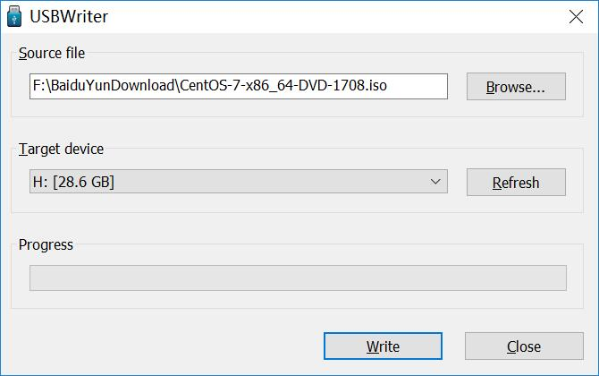

# Kali Linux 安装

## 制作 U 盘

- 准备一个 U 盘，下载这个软件：[USBWriter（提取码：5aa2）](https://pan.baidu.com/s/1gg83h9T)
- USBWriter 的使用很简单，如下图即可制作一个 CentOS 系统盘

 

## 安装过程

- 最新的几个版本安装过程都是类似的，大家可以参考这个视频教程：
	- <https://www.bilibili.com/video/av16009708?from=search&seid=4281822536286289531>
	- 其中，安装第一步选择中文，安装完成就会是中文的，不需要像上面这个视频那么麻烦。
- 安装过程，比较差的机子差不多要 20 ~ 30 分钟。
